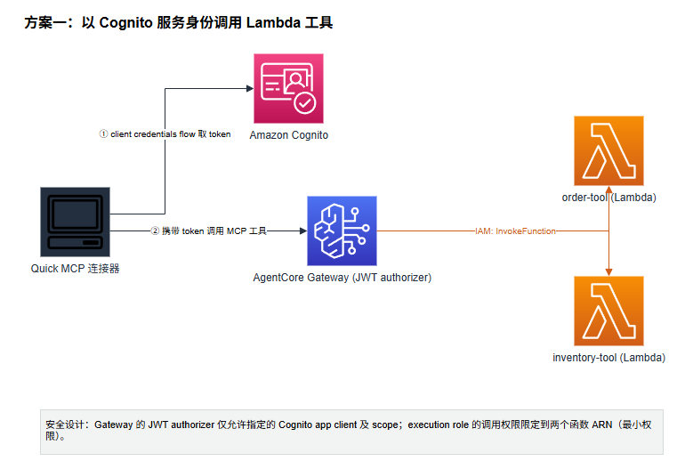
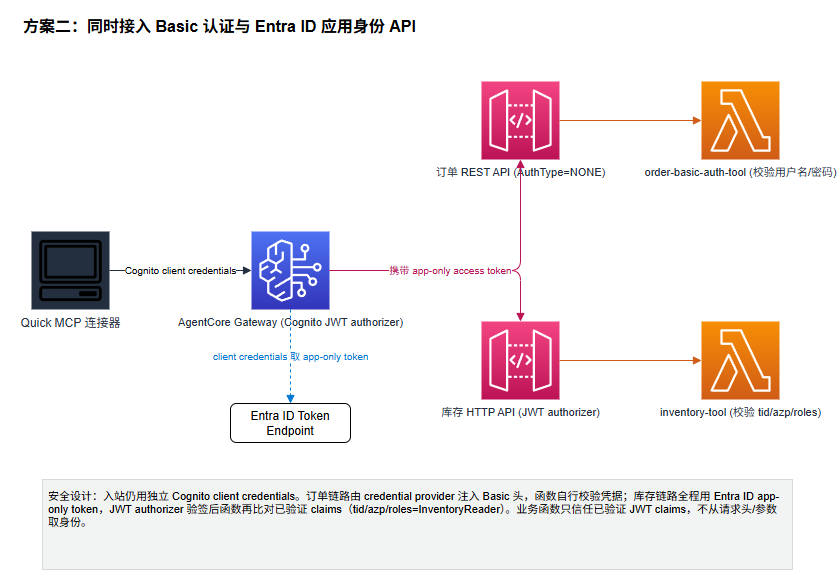
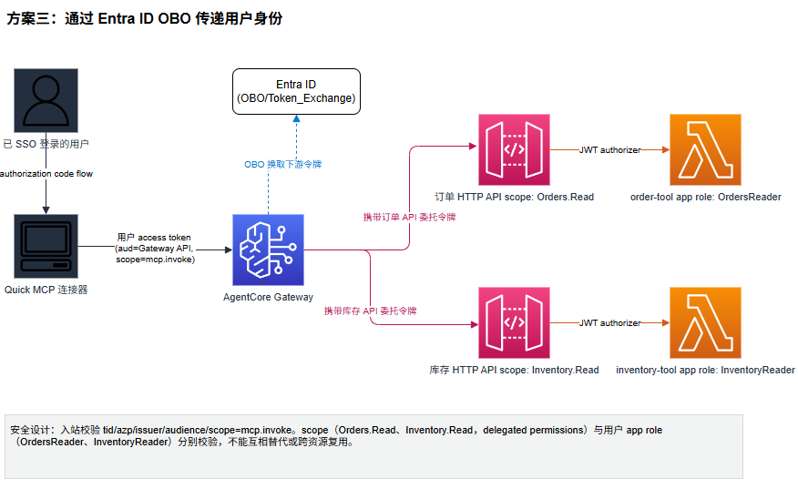
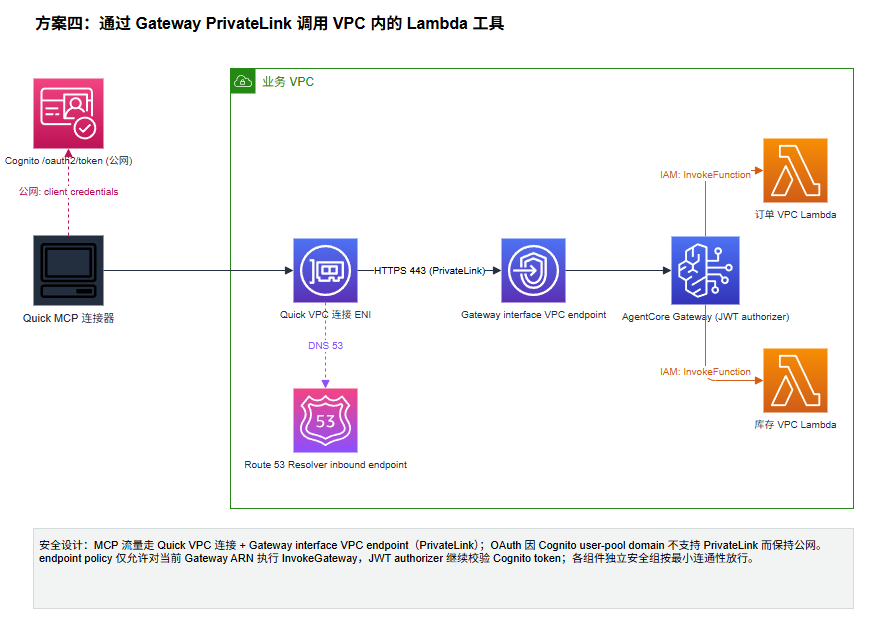

# 用 Amazon Quick MCP 连接器与 Amazon Bedrock AgentCore 安全接入企业应用

客户是一家能源企业，现已使用 Amazon Quick 作为办公智能体。客户一线的检修人员希望在 Amazon Quick 里问一句"这批检修工单要用的备件，西南区仓库还差多少、会不会缺货"， AI 直接给出答案。

而在能源行业的物资供应链语境里，备件与物资的采购需求对应就是"订单"系统，各区域仓库的备件库存对应就是"库存"系统。但订单系统是十年前上线的一套 REST 服务，只认 Basic 认证；库存是近两年上云的新 API，走 Entra ID 应用身份；还有一部分数据因关键基础设施合规要求只能在 VPC 内网访问。业务方要的是"一句话拿到答案"，而 IT 与安全团队要的是"这次访问用的是谁的身份、有没有越权、凭据会不会泄露"。

这正是企业落地生成式 AI 时最常见的难题：员工已经可以在 Amazon Quick 中使用生成式 AI，但订单、库存以及 CRM、ITSM 等业务能力，往往仍分散在受既有身份和网络策略保护的系统里。 真正的难题不是"让 Quick 调用一个 API"，而是**在调用的同时，保留企业对身份、权限和凭据的既有控制**——谁能登录、谁能调用工具、谁能访问哪些业务数据，这三件事必须分别管住。

本文用一个贯穿始终的例子——"先查询订单需求，再检查库存可用性"——演示如何通过 Amazon Quick MCP 连接器和 Amazon Bedrock AgentCore Gateway 安全访问企业应用。文中给出四种接入方案，它们使用完全相同的只读业务逻辑，只在身份、凭据和网络边界上不同，因此可以清晰地对比出每种方案的取舍与适用场景。

本文面向已采用 Microsoft Entra ID 作为身份提供商（IdP），并完成 Amazon Quick 单点登录（SSO）配置的企业客户。完整的部署参数、CloudFormation 模板和 Entra ID 逐步配置，都在配套的 GitHub 示例仓库 https://github.com/nwcd-samples/quick-agentcore-mcp-connector-sample 中，本文关注在架构思想与选型判断。

> 为简洁起见，下文将 Amazon Quick 简称 **Quick**，Amazon Quick MCP Connector 简称**连接器**，Amazon Bedrock AgentCore Gateway 简称 **Gateway**，Microsoft Entra ID 简称 **Entra ID**。**MCP** 指模型上下文协议（Model Context Protocol）；**Gateway target** 指 Gateway 接入的业务函数或 API。

## 核心价值

生成式 AI 在企业里能创造多大价值，往往不取决于模型多强，而取决于它能否安全地触达企业的核心业务系统。一旦 AI 助手需要调用核心业务系统，立即就会面临三个问题：谁能用？调用时用的是谁的身份？后端会不会被越权访问？本文给出的答案是一套可落地、可审计、且不绕开企业既有安全体系的接入模式。核心价值包括三点：

- **复用既有身份体系，而非另起炉灶。** 方案直接建立在企业已有的 Entra ID 与 SSO 之上，AI 的访问被纳入现有的身份治理，而不是新增一套影子权限。
- **身份、权限、网络三条边界各自可控。** 用户登录、工具调用、后端访问被明确拆开分别授权，可以逐条评审、逐条收紧，而不是面对一个"全通或全不通"的黑盒。
- **凭据不落地、权限最小化、访问可审计。** client secret、Basic 凭据、access token 均不放在 AI 助手客户端，出站访问按最小权限配置，每一次调用都有明确的身份与授权依据。

简而言之，这套模式让企业既能享受 Quick 带来的生产力，又能把 AI 的访问牢牢约束在既有的身份、权限和网络策略之内。

## 核心思想：三条独立的信任边界

理解本文所有方案的关键，是先看清一条调用链上其实存在三条互相独立的信任边界：

```text
企业用户 ── Entra ID SSO ──> Quick
Quick ── MCP 连接器 ──> Gateway ── Gateway target ──> 企业业务系统
```

一个常见的误解是：用户用 SSO 登录了 Quick，这个身份就会自动一路透传到后端业务系统。但事实并非如此，登录 Quick 不会自动把 SSO token 用于工具调用——连接器到 Gateway 的入站访问、以及 Gateway 到业务系统的出站访问，仍需分别配置身份与权限。把这三条边界分开设计，正是让 AI 调用与企业既有安全策略保持一致的前提。

| 信任边界 | 身份机制 | 核心责任 |
| --- | --- | --- |
| 用户 → Quick | 既有 Entra ID SSO | 确认谁可以登录 Quick |
| 连接器 → Gateway（入站） | Cognito client credentials flow，或 Entra ID authorization code flow | 验证谁可以发现和调用 MCP 工具 |
| Gateway → 业务系统（出站） | IAM、Basic 认证、Entra ID 应用身份或用户委托 | 为每个 target 单独配置下游访问权限 |

两种 OAuth 流程贯穿全文，值得先记住它们的分工：client credentials flow（客户端凭据流程） 使用应用身份，适用于机器到机器（M2M）调用；authorization code flow（授权码流程） 获取用户委托的 access token，能把"当前是哪个用户"带到后端。

## 四种方案概览

四种方案围绕出站认证方式和网络要求的不同而展开。它们共用同一套订单/库存业务逻辑，因此可以直接横向对比——你可以按"下游系统是什么认证方式、要不要区分用户、要不要走内网"来对号入座：

| 方案 | 对应的典型场景 | 入站认证 | 出站认证 | 网络 |
| --- | --- | --- | --- | --- |
| 方案一 服务身份 | 无需根据用户鉴权，统一身份访问业务系统即可 | Cognito client credentials | IAM | 公网 |
| 方案二 混合下游认证 | 老系统走 Basic、新 API 走企业应用身份，新旧并存 | Cognito client credentials | 订单 Basic；库存 Entra ID 应用身份 | 公网 |
| 方案三 用户身份委托 | 不同用户看不同数据，需按人授权 | Entra ID authorization code | Entra ID OBO（代表用户） | 公网 |
| 方案四 私网访问 | 合规要求业务系统只能内网访问 | Cognito client credentials | IAM | PrivateLink / VPC |

下面逐一说明每个方案对应的场景、架构，以及**为什么这样选型和设计**。

> 下述四个方案，备件订单与库存能力都是 Lambda 函数的方式部署。这只是为简化方案演示所作的假设，可根据客户实际情况调整为 ECS/EKS 等方式部署。

---

## 方案一：以 Cognito 服务身份调用 Lambda 工具

**场景代入：** 假设数据本身不区分调用者——谁问都返回同一份结果。团队想尽快把它接入 Quick 让一线人员全员可用，不希望为此新引入一套复杂的用户级权限体系。

连接器通过 Cognito client credentials flow 获取 token，Gateway 验证后用自己的 execution role 调用两个业务函数。

在这个方案里，订单和库存函数均无须实现任何认证鉴权逻辑。



**为什么这样选型：** 既然后端不需要区分"是哪个用户在问"，那就没必要为每次调用传递用户身份——用统一的服务身份（client credentials，M2M 模式）是最简单、运维成本最低的选择。这也是大多数团队的起点。

**关键安全设计：**

- Gateway 的 JWT authorizer 仅允许指定的 Cognito app client 及调用 scope——不是任何持有 token 的人都能调用工具。
- Gateway execution role 的 Lambda 调用权限限定到那两个函数的 ARN，遵循最小权限原则。整个出站访问以服务身份完成，与"哪个用户在用"无关。

## 方案二：同时接入 Basic 认证与 Entra ID 应用身份的 API

**场景代入：** 前面提到的客户——备件订单系统是十年前的 REST 老系统，只认 Basic 认证，短期内无法改造；库存是新上云的 API，已接入 Entra ID 应用身份。团队不想为了接入 AI 而动老系统，但也想让新系统用上更现代的身份机制。这种"新旧并存"在传统行业尤其普遍——调度、资产等核心系统往往沿用多年，新建的物资平台才用上现代身份。

关键在于，**入站认证保持不变（仍是 Cognito client credentials），出站则为每个 target 单独配置凭据**。

在这个方案里，订单函数自己实现对用户名/密码的校验，而库存函数检验 JWT Claims 中的关键字段。



**为什么这样设计：** 三条信任边界独立，意味着**出站认证可以"一个 target 一种方式"，互不影响**。老系统维持 Basic 认证、不被强行改造，新系统用 Entra ID 应用身份、享受集中身份治理——两者在同一个 Gateway 下和平共存。这正是"分别设计每条边界"带来的最直接好处。

**关键安全设计：**

- **订单链路（Basic 认证）**：REST API 路由使用 `AuthorizationType=NONE`，由 AgentCore Gateway credential provider 注入 `Authorization: Basic ...`；订单函数**必须自行校验用户名和密码**后再查询。凭据由业务团队管理和轮换。

- **库存链路（Entra ID 应用身份）**：全程使用 Entra ID 签发的 app-only access token。鉴权分两步：

  ① HTTP API 的原生 JWT authorizer 验证签名、`iss`、`aud` 及时间 claims；

  ② 库存函数从**已验证的 JWT claims**（`requestContext.authorizer.jwt.claims`）中读取，与配置的期望值逐一比对：`tid` 必须匹配指定 tenant，`azp`/`appid` 必须是专用库存客户端的 Application ID，`roles` 必须包含 `InventoryReader`。

- 一条重要原则：**业务函数只信任已验证的 JWT claims，绝不从普通请求头、查询参数、请求体或工具参数中获取身份和角色。**

## 方案三：通过 Entra ID OBO 传递用户身份

**场景代入：** 同样是查备件订单查库存，但客户提出更深入的要求，**不同角色看到不同范围的数据**——西南区的检修人员只能看本辖区电站的备件订单，物资管理员才能看全网库存。此时"谁在提问"必须一路传到后端，由后端按这个人的业务角色决定放行哪些数据。这是四个方案中身份链路最完整的一个。

与前两个方案不同，这里的入站认证改用 **authorization code flow**：用户虽已通过 SSO 登录 Quick，连接器仍需**单独**为 Gateway API 获取用户 access token；随后 AgentCore Gateway 通过 **On-Behalf-Of（OBO，代表用户流程）**，为每个下游 API 分别换取代表该用户的 access token。

在这个方案里，订单函数和库存函数分别校验用户的 app role。



**为什么这样选型：** 要按人授权，服务身份就不够用了——必须把**用户身份**带到后端。authorization code flow + OBO 正是为此设计：前者拿到"当前用户"的令牌，后者让 Gateway 代表这个用户去换取每个下游资源的专属令牌，从而把用户身份完整、可信地传递到最末端的业务函数。

**关键安全设计：**

- **入站校验**：Gateway 检查 issuer 属于指定 Entra ID tenant、audience 为 Gateway API 的 Application ID、scope 含 `mcp.invoke`、`tid` 匹配  Entra ID tenant ID、`azp` 等于 Quick Client 的 Application ID。
- **出站按资源分别校验**：两个下游 API 各自校验自己的 audience 和 route scope，业务函数再校验用户的 app role：

  | 下游 API | route scope（委托权限） | 用户 app role（业务资格） | 业务函数 |
  | --- | --- | --- | --- |
  | Order API | `Orders.Read` | `OrdersReader` | `order-tool` |
  | Inventory API | `Inventory.Read` | `InventoryReader` | `inventory-tool` |

- 这里有一个容易被混淆、但至关重要的区分：`Orders.Read` / `Inventory.Read` 是 **delegated permissions（scope）**，表示"允许 Gateway 代表用户访问这个资源"；`OrdersReader` / `InventoryReader` 是资源 API 定义并分配给用户的 **app roles**，表示"这个用户有没有业务访问资格"。**两者分别校验，不能互相替代，也不能跨资源复用。** 

- 如需按数据行或字段控制访问，业务函数可以进一步增强，从已经由 API Gateway 验证的 JWT claims 中读取 `tid` 和 `oid`，结合业务权限数据定位到具体的用户并实施授权。继续沿用可信 authorizer claims 作为身份来源，避免直接信任调用方提交的身份字段。

## 方案四：通过 Gateway PrivateLink 调用 VPC 内的 Lambda 工具

**场景代入：** 出于合规与数据安全要求，客户规定核心业务系统**不得暴露在公网**，只能在 VPC 内网访问；同时希望 Quick 到 Gateway 的调用流量也不经过公网。电力、油气等受监管行业常有这类硬性约束。入站认证参考方案一仍用 Cognito client credentials，不同之处在**网络路径**。



**为什么这样设计：** 合规要求的是"网络层面的隔离"，而这与"身份层面的认证"是两件独立的事——所以本方案在方案一的身份机制之上，**只替换网络路径**：MCP 流量通过 Quick VPC 连接和 PrivateLink 走内网，业务 Lambda 放进 VPC。身份与网络双重收口，缺一不可。

**关键安全设计：**

- **MCP 流量与 OAuth 流量走各自的网络路径**：工具调用经 Quick VPC 连接和 Gateway interface VPC endpoint（走 PrivateLink），而 OAuth token 请求访问公共的 Cognito user-pool domain `/oauth2/token`。
- **为什么 auth-server 仍走公网？** Quick 支持分别配置 resource-server VPC connection（`VpcConnectionArn`）与 auth-server VPC connection（`AuthVpcConnectionArn`）。但本方案的授权服务器是 Cognito——**Cognito 的 domain OAuth endpoint、managed login 和 hosted UI 不支持通过 PrivateLink 访问**，`cognito-idp` interface endpoint 也不接收 user-pool domain 请求。因此 `/oauth2/token` 只能继续走公网。假如你的授权服务器提供可从 VPC 访问的 OAuth endpoint，则可以把 auth 流量也收进私网。
- **网络与身份双重收口**：Quick VPC 连接通过 Route 53 Resolver 解析 Gateway 域名，启用 private DNS 后 MCP 请求经 VPC endpoint 到达服务；endpoint policy 仅允许对当前 Gateway ARN 执行 `bedrock-agentcore:InvokeGateway`，Gateway 的 JWT authorizer 则继续校验 Cognito token。Quick ENI、Resolver、Gateway VPC endpoint 和业务 Lambda 各用独立安全组，按最小连通性放行。

## 关于部署

四个方案的根模板与 `deploy.sh` 脚本位于配套仓库的 `cloudformation/` 目录，由 CloudFormation 统一管理场景基础设施；连接器在部署完成后由管理员配置。有几点值得强调：

- 方案一至三通过 ARN 引用预部署的三只共享业务 Lambda；方案四从相同源码打包并管理 VPC 内的专属函数。
- **参数文件只保存非秘密配置和必要的外部 ARN，栈输出不包含任何 client secret、Basic 凭据或 access token**——凭据与秘密始终由 Secrets Manager 等专门机制管理，不落到模板里。

完整的参数、输出、验证命令与 Entra ID 逐步配置，请直接参考仓库文档 https://github.com/nwcd-samples/quick-agentcore-mcp-connector-sample/docs/deploy-step-by-step.md，本文不再展开。

## 总结

本文用同一个贯穿始终的例子，展示了四种把企业应用安全接入 Amazon Quick 的方案，对应四类真实场景：

- **方案一 · 服务身份**：后端不区分用户时，用 Cognito client credentials + 最小权限 IAM，以统一应用身份调用业务系统。
- **方案二 · 混合下游认证**：新旧系统并存时，为不同 target 分别配置 Basic 认证与 Entra ID 应用身份。
- **方案三 · 用户身份委托**：需按人授权时，通过 Entra ID OBO 传递用户身份，并分别校验 scope 与业务 app role。
- **方案四 · 私网访问**：合规要求内网时，MCP 流量经 Gateway PrivateLink，业务系统运行在 VPC 内；因 Cognito domain 限制，OAuth 保持公网。

这些能力可以按业务需求自由组合。但无论选择哪种方案，落地时都应回到同一条原则：**分别设计"用户登录 Quick""连接器访问 Gateway""Gateway 访问业务系统"这三条信任边界，让 AI 的工具调用与企业既有的身份、权限和网络策略保持一致。** 这才是让生成式 AI 安全地接入企业核心系统的根本。

---

*完整代码、CloudFormation 模板与 Entra ID 配置指南，见 https://github.com/nwcd-samples/quick-agentcore-mcp-connector-sample。Amazon Quick 与 Entra ID 的 SSO 集成可参考 https://aws.amazon.com/cn/blogs/china/microsoft-entra-id-integration-iam-identity-center-implement/。*
