# 使用 Amazon Quick MCP 连接器与 Amazon Bedrock AgentCore 安全连接企业应用

企业员工已经可以在 Amazon Quick 中使用生成式 AI，但订单、库存以及客户关系管理（CRM）、IT 服务管理（ITSM）等业务能力，往往仍分散在受既有身份和网络策略保护的系统中。如何让 Quick 调用这些能力，同时保留企业对身份、权限和凭据的控制，是企业应用集成需要解决的问题。

本文以“查询订单需求，再检查库存可用性”为例，演示通过 Amazon Quick MCP 连接器和 Amazon Bedrock AgentCore Gateway 安全访问企业应用的四种典型场景：服务身份访问、混合下游认证、用户身份委托，以及私网访问。四个场景使用相同的只读业务逻辑，分别展示不同的身份、凭据和网络边界。

本文面向已采用 Microsoft Entra ID 作为身份提供商（IdP），并完成 Amazon Quick 单点登录（SSO）配置的企业客户。SSO 配置可参考 https://aws.amazon.com/cn/blogs/china/microsoft-entra-id-integration-iam-identity-center-implement/。

## 方案概览

本文将 Amazon Quick 简称为 **Quick**，将 Amazon Quick MCP Connector 简称为 **连接器**，将 Amazon Bedrock AgentCore Gateway 简称为 **Gateway**，将 Microsoft Entra ID 简称为 **Entra ID**。MCP 指模型上下文协议（Model Context Protocol）；Gateway target 指 Gateway 接入的业务函数或 API。

四个场景共用以下调用链路：

```text
企业用户 ── Entra ID SSO ──> Quick
Quick ── MCP 连接器 ──> Gateway ── Gateway target ──> 企业业务系统
```

**Quick 登录、Gateway 入站访问和下游业务访问是三条独立的信任边界。** 登录 Quick 不会自动把 SSO token 用于工具调用，连接器和 Gateway target 仍需分别配置身份与权限。

| 信任边界 | 身份机制 | 核心责任 |
| --- | --- | --- |
| 用户 → Quick | 既有 Entra ID SSO | 确认谁可以登录 Quick |
| 连接器 → Gateway（入站） | Amazon Cognito client credentials flow，或 Entra ID authorization code flow | 验证谁可以发现和调用 MCP 工具 |
| Gateway → 企业业务系统（出站） | IAM、Basic 认证、Entra ID 应用身份或用户委托 | 为各个 Gateway target 配置独立的下游访问权限 |

根据业务系统的认证方式和网络要求，可以选择以下场景：

| 场景 | 入站认证：连接器 → Gateway | 出站认证：Gateway → 业务系统 | 业务入口 | 适用需求 |
| --- | --- | --- | --- | --- |
| 场景一 | Cognito client credentials flow | IAM | 原生 Lambda target | 以服务身份调用 AWS Lambda 函数 |
| 场景二 | Cognito client credentials flow | 订单：Basic 认证；库存：Entra ID client credentials flow | 订单 REST API；库存 HTTP API | 同时接入传统系统、使用企业应用身份的 API |
| 场景三 | Entra ID authorization code flow | Entra ID 代表用户流程（On-Behalf-Of，OBO） | 两个 HTTP API | 根据当前用户的业务角色授权 |
| 场景四 | Cognito client credentials；resource-server走Quick VPC连接 | IAM | 专属VPC Lambda target | Gateway通过PrivateLink，转发请求 到运行在VPC内的业务 |

OAuth 2.0 client credentials flow（客户端凭据流程）使用应用身份，适用于机器到机器（M2M）调用；OAuth 2.0 authorization code flow（授权码流程）获取用户委托的 access token。

下文使用 token（令牌）、scope（授权范围）和 claim（token 中的声明字段）等专业术语。Application ID 均指 Entra 应用注册中的 **Application (client) ID**；配置字段、参数名和权限值保留原始大小写。

### 演示工具

演示先调用订单工具，取得聚合后的订单需求及 SHA-256 校验和，再把结果传给库存工具，计算库存差额和缺货风险。校验和用于检查两个工具之间传递的数据是否一致，身份认证和业务授权由各场景的独立控制负责。

| Lambda 函数 | 使用场景与事件格式 | 业务与授权职责 |
| --- | --- | --- |
| `order-tool`源码 | 场景一：原生工具参数；场景三：HTTP API payload 2.0；场景四：栈内VPC专属副本 | 返回订单需求与校验和；场景三还要求可信`roles`包含`OrdersReader` |
| `inventory-tool`源码 | 场景一：原生工具参数；场景二、三：HTTP API payload 2.0；场景四：栈内VPC专属副本 | 校验订单输出并计算库存风险；场景二、三还校验对应身份和角色 |
| `order-basic-auth-tool` | 场景二：REST API proxy payload 1.0 | 先校验 Basic 凭据，再执行订单逻辑；凭据由业务团队管理和轮换 |

### 部署范围

四个场景的根模板位于 [`cloudformation/scenarios/`](../cloudformation/scenarios/)，由 [`cloudformation/deploy.sh`](../cloudformation/deploy.sh) 打包并部署。完整参数、输出和验证命令见 [CloudFormation 部署说明](../cloudformation/README.md)。

| 场景栈管理的资源 | 需要单独准备或管理的资源 |
| --- | --- |
| Gateway、targets、IAM、入站身份、场景API Gateway和credential provider；场景四还管理专属VPC Lambda与网络资源 | 场景一至三的三只共享业务Lambda、外部Secrets Manager值、Entra应用、既有Quick SSO、连接器和artifact bucket |

本示例由CloudFormation管理场景基础设施，连接器在部署后由管理员配置。场景一至三通过ARN引用预部署业务函数；场景四从相同源码打包并管理VPC内专属函数。参数文件仅保存非秘密配置和必要的外部ARN，栈输出不包含client secret、Basic凭据或access token。

## 前提条件与通用部署步骤

### 前提条件

开始前，请准备以下环境：

- Entra ID tenant，以及已完成 SSO 配置的 Quick；演示用户能够使用企业账号登录 Quick。
- 已配置目标亚马逊云科技账号和区域的 AWS CLI v2；目标区域支持所选场景使用的 Quick、AgentCore Gateway 和 AgentCore Identity 功能。
- Bash 环境，以及业务函数部署脚本所需的 Python 3 和 Boto3。下文命令均在仓库根目录的 Bash 环境执行。
- 目标区域中已有的 Amazon S3 部署产物存储桶，以下使用 `<ARTIFACT_BUCKET>` 表示。
- 具备创建模板资源、传递模板所需 IAM 角色及读取输入凭据权限的部署身份。
- 场景一至三需要预部署共享业务Lambda；场景四在栈内从相同源码创建VPC专属函数。场景二、三还需要按后文完成Entra ID应用和凭据配置。

### 下载代码并准备业务函数

1. 下载示例代码，进入仓库根目录。

   ```bash
   git clone https://github.com/nwcd-samples/quick-agentcore-mcp-connector-sample.git
   cd quick-agentcore-mcp-connector-sample
   ```

2. 设置目标区域，与本次使用的 Quick 区域保持一致。

   ```bash
   export AWS_REGION=<AWS_REGION>
   ```

3. 部署场景一、二、三且尚未准备共享业务函数时，运行独立bootstrap并记录函数ARN和Basic secret ARN；场景四跳过本步。

   ```bash
   python3 business-lambdas/deploy.py --region "$AWS_REGION"
   ```

   该脚本独立管理三个业务函数及其所需资源。具体管理边界见 [业务 Lambda 部署说明](../cloudformation/README.md#11-业务-lambda-bootstrap)。

### 部署所选场景

1. 将对应参数示例复制到仓库外的受保护目录，再编辑副本。`/secure/path` 表示自行准备的目录。

   ```bash
   cp cloudformation/parameters/<SCENARIO>.example.json /secure/path/<SCENARIO>.json
   chmod 600 /secure/path/<SCENARIO>.json
   ```

2. 替换账号、区域、函数 ARN、凭据 ARN、Cognito 域名前缀和 Entra ID 应用 ID 等占位值。保留仓库中的参数示例，避免将环境配置写回示例文件。

3. 将 `<SCENARIO>` 替换为 `scenario1`、`scenario2`、`scenario3` 或 `scenario4`，将 `<SCENARIO_ABBR>` 替换为对应的 `s1`、`s2`、`s3` 或 `s4`，执行部署。

   ```bash
   : "${AWS_REGION:?Set AWS_REGION to the deployment region}"
   ./cloudformation/deploy.sh \
     <SCENARIO> quick-agentcore-<SCENARIO_ABBR> <ARTIFACT_BUCKET> \
     /secure/path/<SCENARIO>.json "$AWS_REGION"
   ```

脚本先校验参数与当前亚马逊云科技账号身份、区域，再打包模板、部署场景栈并打印不含凭据值的输出。后续各场景分别说明参数来源、连接器配置和预期验证结果。

## 场景一：使用 Cognito 服务身份调用 Lambda 工具

### 架构与安全设计

场景一适用于两个业务工具都以 Lambda 函数提供服务、且允许使用统一应用身份访问的情况。连接器通过 Cognito client credentials flow 获取 token，Gateway 验证 token 后，使用 execution role 调用两个业务函数。

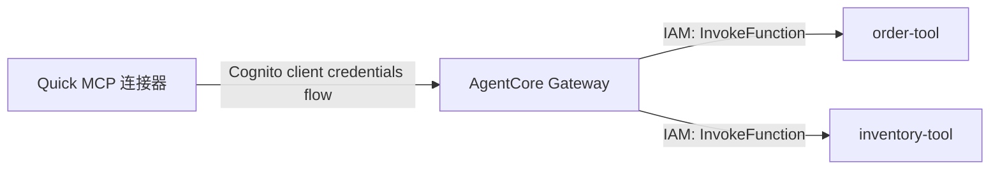
```mermaid
flowchart LR
    Q[Quick MCP 连接器] -->|Cognito client credentials flow| G[AgentCore Gateway]
    G -->|IAM: InvokeFunction| O[order-tool]
    G -->|IAM: InvokeFunction| I[inventory-tool]
```

Gateway 的 JWT authorizer 仅允许指定的 Cognito app client 及调用 scope。Gateway execution role 的 Lambda 调用权限限定到输入的两个函数 ARN；两个原生 Lambda target 均使用 `GATEWAY_IAM_ROLE`。

### 部署场景

使用 `scenario1.example.json` 准备参数，并按通用步骤部署 `scenario1`。

| 参数 | 说明 |
| --- | --- |
| `Prefix` | 资源名前缀，例如 `quick-agentcore-s1` |
| `CognitoDomainPrefix` | 区域内唯一的 Cognito 托管域名前缀 |
| `GatewayScopeIdentifier` | Gateway 对应的 Cognito resource server identifier；模板追加 `/invoke` |
| `OrderToolLambdaArn` | 预部署 `order-tool` 函数的 ARN |
| `InventoryToolLambdaArn` | 预部署 `inventory-tool` 函数的 ARN |

模板会约束两个 ARN 中的函数名，避免连接到其他业务函数。

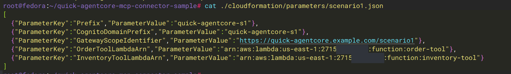

*图 1：场景一的部署参数示例。*

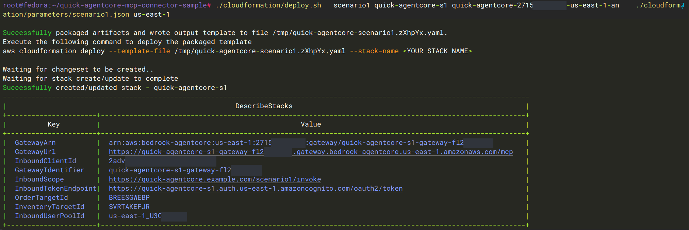

*图 2：场景一的部署命令与结果。*

部署完成后，可以在控制台核对以下资源。

**Cognito 入站身份。** 场景栈创建用户池、resource server、带 client secret 的 app client 和托管域名。

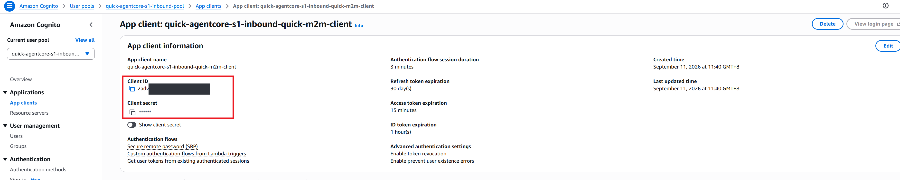

*图 3：场景一的 Cognito app client 配置。*

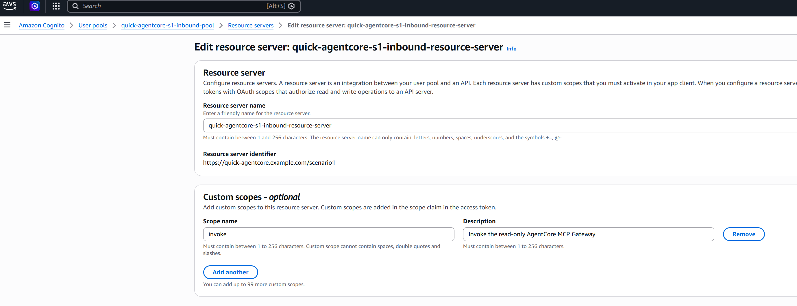

*图 4：场景一的 Cognito resource server 配置。*

**Gateway execution role。** execution role 仅能调用两个业务函数。

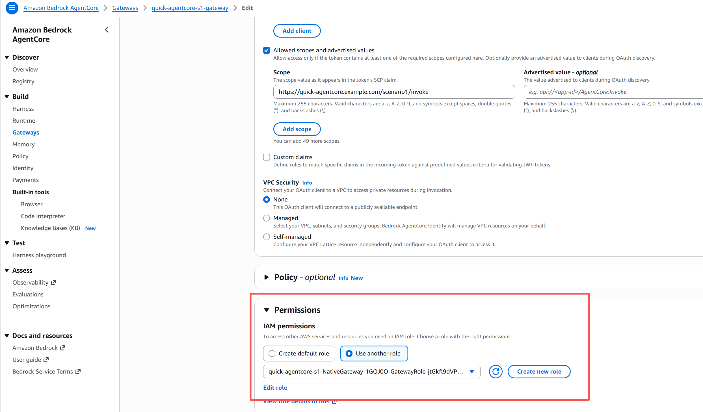

*图 5：场景一的 Gateway execution role 权限引用。*

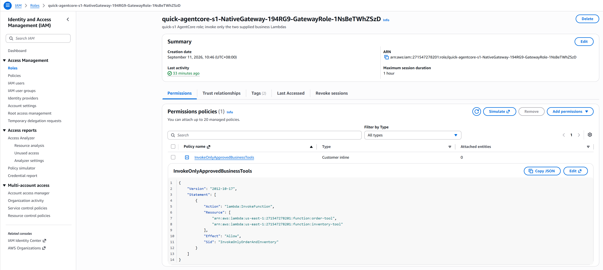

*图 6：场景一的 Gateway execution role 权限详情。*

 **Gateway 入站授权。**Gateway 使用 `CUSTOM_JWT` 入站授权，并且入站认证中 "Allowed clients" 和 "Alllowed scopes and advertised values" ，分别与 Cognito 的 "app client" 和 "resource server" 配置一致。

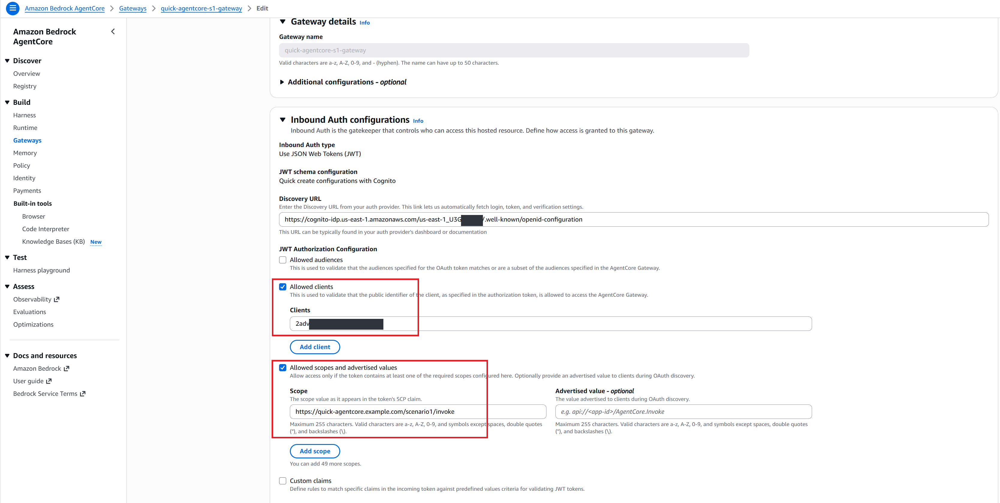

*图 7：场景一的 Gateway 配置。*

**两个原生 Lambda target。** 每个 target 声明对应的只读工具定义。

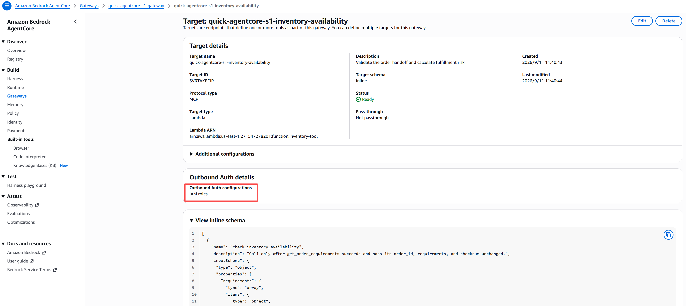

*图 8：场景一的原生 Lambda target。*

记录以下栈输出，供连接器配置和资源核对使用。

| 输出 | 用途 |
| --- | --- |
| `GatewayArn`、`GatewayIdentifier`、`GatewayUrl` | Gateway 资源核对与 MCP 端点配置 |
| `OrderTargetId`、`InventoryTargetId` | 核对两个 Gateway target 的状态 |
| `InboundUserPoolId`、`InboundClientId` | 定位 Cognito 用户池和 app client，读取对应 client secret |
| `InboundScope`、`InboundTokenEndpoint` | 配置 OAuth scope 和 token endpoint |

### 配置 Quick 连接器

在 Quick 中创建 MCP 连接器，按以下映射填写字段。

| 连接器字段 | 配置值 |
| --- | --- |
| MCP server endpoint | 栈输出 `GatewayUrl` |
| 认证方式 | 服务到服务 OAuth，即 client credentials flow |
| Client ID | 栈输出 `InboundClientId` |
| Client secret | `InboundUserPoolId` 对应用户池中，`InboundClientId` 对应 app client 的 client secret |
| Token URL | 栈输出 `InboundTokenEndpoint` |
| Scope | 栈输出 `InboundScope` |

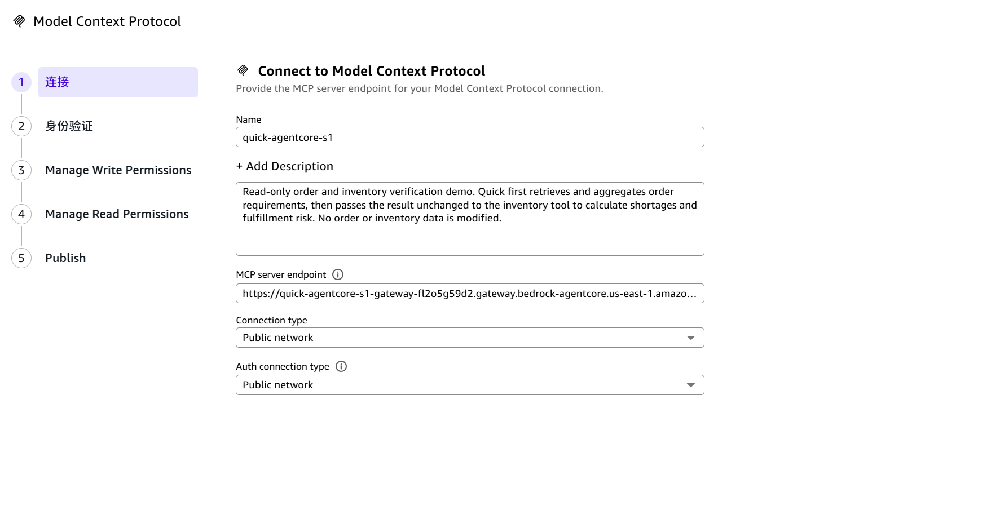

*图 9：场景一的连接器 MCP 端点配置。*

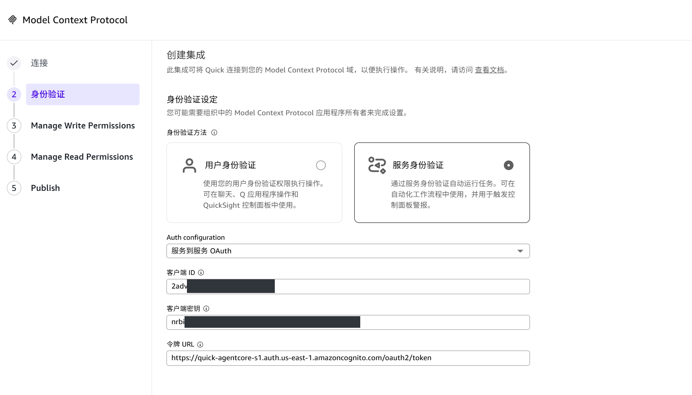

*图 10：场景一的连接器服务到服务 OAuth 配置。*

根据组织的共享策略选择可使用该连接器的用户范围。选择 **Everyone in your organization**，然后单击 **Publish** 发布。

### 验证业务调用

在 Quick Desktop 中打开 **Capabilities → Browse more**，启用场景一的连接器。示例名称以 `s1` 结尾。

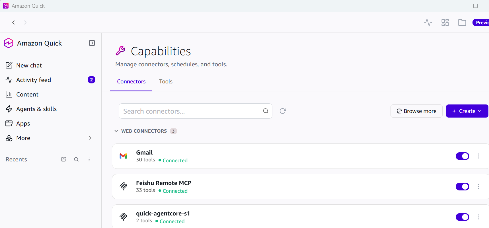

*图 11：在 Quick Desktop 中启用场景一连接器。*

输入以下请求，检查 Quick 是否先查询订单需求，再调用库存工具。

> 查询订单 ORDER-1003 的商品需求并检查库存可用性。

下图展示了一次业务调用示例。

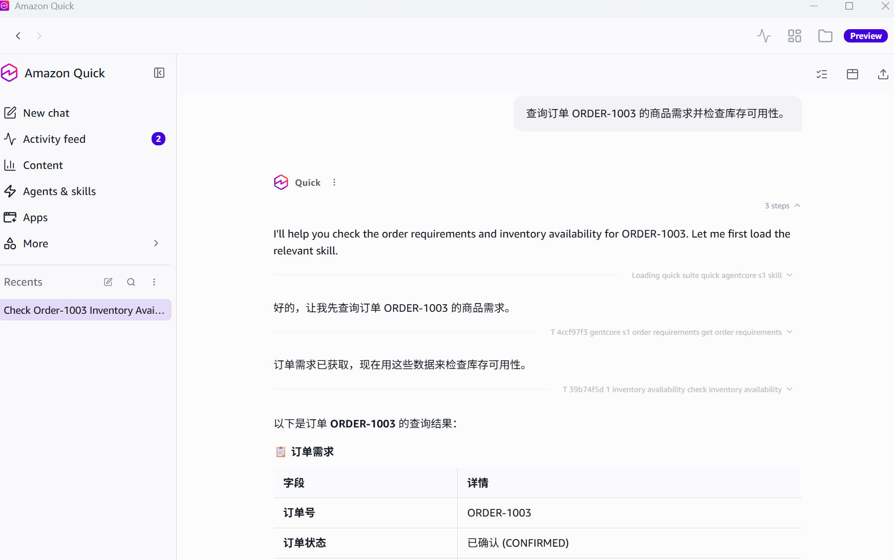

*图 12：场景一的订单与库存工具调用示例。*

## 场景二：同时接入 Basic 认证与 Entra ID 应用身份 API

### 架构与安全设计

场景二适用于企业同时保留传统 Basic 认证接口和使用 Entra ID 应用身份的 API。连接器到 Gateway 的入站认证仍使用独立的 Cognito client credentials flow；两个下游 target 分别配置凭据。

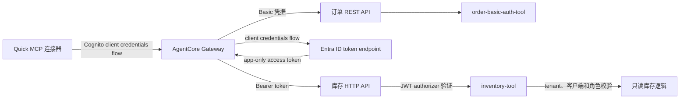
```mermaid
flowchart LR
    Q[Quick MCP 连接器] -->|Cognito client credentials flow| G[AgentCore Gateway]
    G -->|Basic 凭据| OA[订单 REST API]
    OA --> OB[order-basic-auth-tool]
    G -->|client credentials flow| E[Entra ID token endpoint]
    E -->|app-only access token| G
    G -->|Bearer token| IA[库存 HTTP API]
    IA -->|JWT authorizer 验证| IV[inventory-tool]
    IV -->|tenant、客户端和角色校验| R[只读库存逻辑]
```

订单 REST API 的路由使用 `AuthorizationType=NONE`，由 Gateway credential provider 注入 `Authorization: Basic ...`。订单函数必须自行校验用户名和密码，再执行查询。

库存链路完全使用 Entra ID app-only access token，故而无需为库存 API 另建 Cognito 用户池。授权分两步完成：

1. HTTP API 的原生 JWT authorizer 验证签名、issuer（`iss`）、audience（`aud`）以及 token 时间 claims。
2. 库存函数从 `requestContext.authorizer.jwt.claims` 读取已验证的 JWT claims，与 CloudFormation 配置的 stage variables 比较：`tid` 必须等于指定 tenant，`azp` 或兼容字段 `appid` 必须等于专用库存客户端 Application ID，`roles` 必须包含 `InventoryReader`。

stage variables 由 API 配置提供。业务函数不从普通请求头、查询参数、请求体或工具参数获取身份和角色。

### 准备 Entra ID 应用与凭据

本场景需要两个应用注册：代表受保护资源的 `Inventory API resource app`，以及代表调用方的 `AgentCore Inventory client app`。

下文的**应用注册（App registrations）**用于配置 Application ID、API 权限定义和 client secret；**企业应用（Enterprise applications）**用于管理该应用在 tenant 中的服务主体及用户或组分配。两者在后续步骤中分别使用。

#### 步骤 1：注册库存资源 API

在 **Microsoft Entra admin center → Identity → Applications → App registrations** 中注册 `Inventory API resource app`。业务 API 仍运行在 AWS 上，此应用注册用于定义其身份与权限。

在应用清单中，将 `api.requestedAccessTokenVersion` 设置为 `2`。

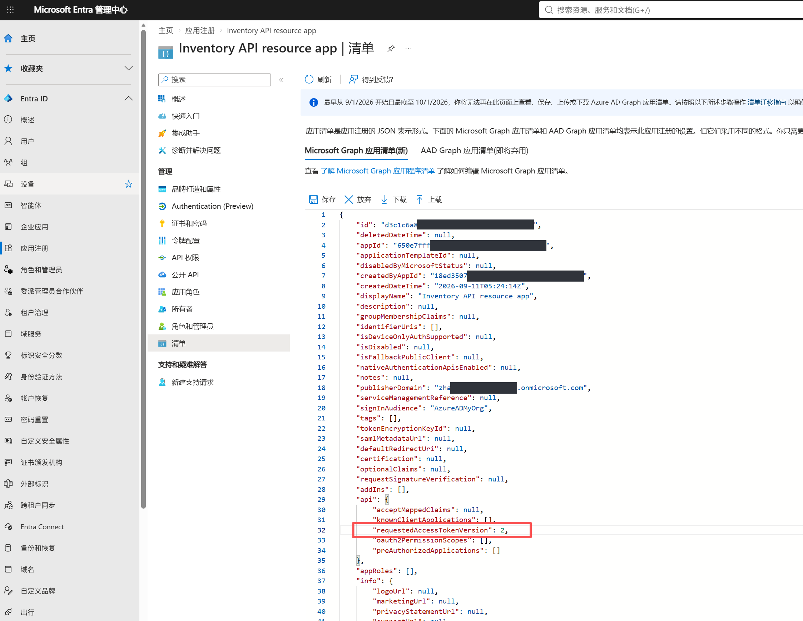

*图 13：库存资源 API 的 access token 版本配置。*

创建值为 `InventoryReader` 的 app role，允许的成员类型选择 **Applications（应用程序）**。

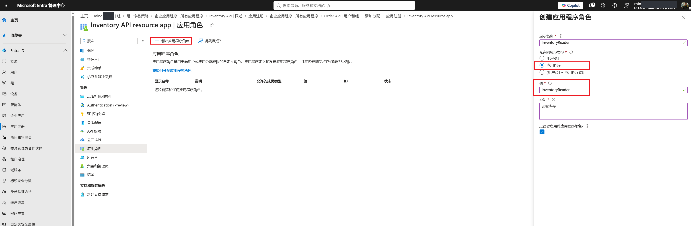

*图 14：库存资源 API 的 InventoryReader app role。*

设置 **Application ID URI** 为 `api://<InventoryApiApplicationId>`。

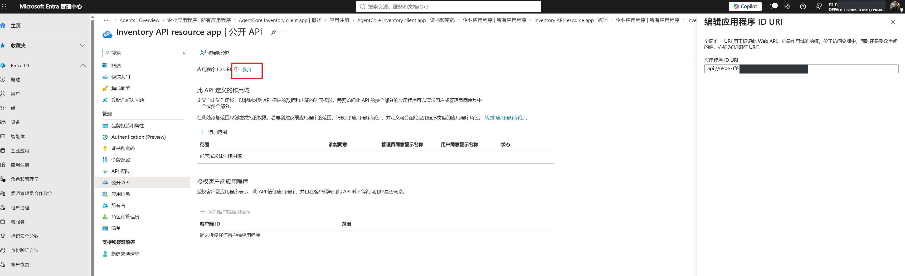

*图 15：库存资源 API 的 Application ID URI。*

#### 步骤 2：注册库存调用客户端

注册 `AgentCore Inventory client app`，添加库存资源 API 的 `InventoryReader` **应用程序权限（Application permissions）**，并授予管理员同意。

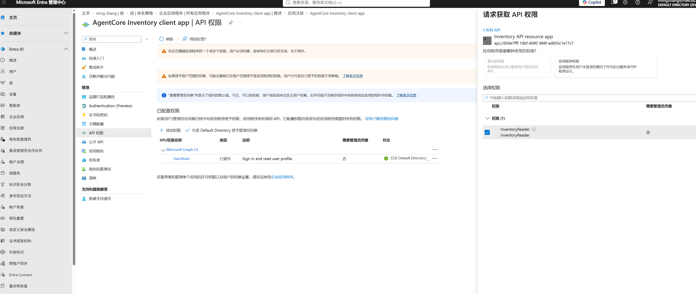

*图 16：为库存客户端添加 InventoryReader 应用程序权限。*

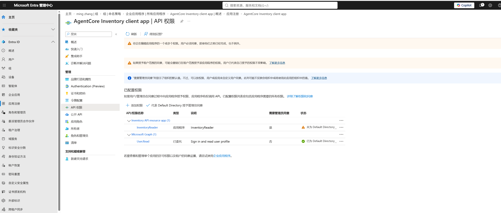

*图 17：为库存客户端授予管理员同意。*

为客户端创建 client secret，按组织策略设置有效期，并保存其 **Value**。

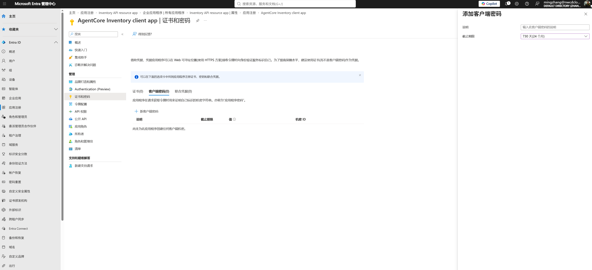

*图 18：创建库存 client secret。*

将密钥值存入 AWS Secrets Manager，并记录返回的 ARN。以下展示所需 JSON 格式；占位值需要替换为实际 client secret。

```bash
aws secretsmanager create-secret \
  --name quick-agentcore-s2-inventory-client-secret \
  --secret-string '{"clientSecret":"<Inventory client secret Value>"}' \
  --region "$AWS_REGION"
```

Gateway 使用该客户端的 Application ID 和密钥，通过 tenant 专属的 v2.0 token endpoint执行 client credentials flow，请求 scope 为 `api://<InventoryApiApplicationId>/.default`。

#### 步骤 3：复用订单 Basic 凭据

业务函数部署脚本会创建或复用名为 `quick-agentcore/order-basic-auth-tool` 的 Secrets Manager 凭据，并将其 ARN 配置给 `order-basic-auth-tool`。

将同一个 ARN 填入 `OrderBasicSecretArn`，使 Gateway 的 API 密钥 credential provider 与订单函数读取同一份凭据。该凭据的 JSON 格式为：

```json
{"base64Credentials":"<base64(username:password)>"}
```

### 部署场景

使用 `scenario2.example.json` 准备参数，并部署 `scenario2`。

| 参数 | 说明 |
| --- | --- |
| `Prefix`、`CognitoDomainPrefix`、`GatewayScopeIdentifier` | 本场景独立的资源前缀与 Cognito 入站身份配置 |
| `OrderBasicAuthToolLambdaArn` | 预部署 `order-basic-auth-tool` 函数的 ARN |
| `InventoryToolLambdaArn` | 支持 HTTP API payload 2.0 和 Entra ID 应用身份授权的库存函数 ARN |
| `OrderBasicSecretArn`、`OrderBasicSecretJsonKey` | 共享 Basic 凭据 ARN；JSON key固定为 `base64Credentials` |
| `EntraTenantId` | 库存 token 的签发Entra tenant ID；使用指定 tenant，不能填 `common` 或 `organizations` |
| `InventoryApiApplicationId` | 库存资源 API 的 Application ID，也是 HTTP API JWT authorizer 接受的 audience |
| `InventoryClientApplicationId` | 专用库存客户端的 Application ID，也是函数允许的 `azp` 或 `appid` |
| `InventoryOAuthClientSecretArn`、`InventoryOAuthClientSecretJsonKey` | 库存 client secret 的 Secrets Manager ARN；JSON key固定为 `clientSecret` |
| `InventoryAppRole` | 固定为 `InventoryReader`，模板拒绝其他值 |
| `StageName` | 订单 REST API 与库存 HTTP API 的部署阶段，默认 `prod` |

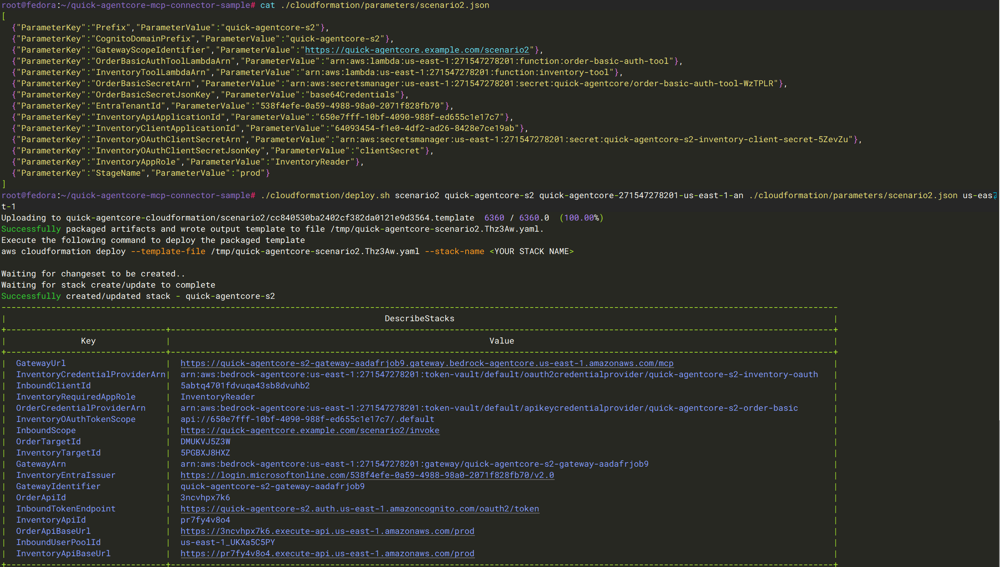

*图 19：场景二的部署参数与命令。*

部署后，重点核对以下配置。

**订单 API。** 模板通过 `AWS::Serverless::Api` 创建区域级 REST API；`POST /order-requirements` 由业务函数校验 Basic 凭据。

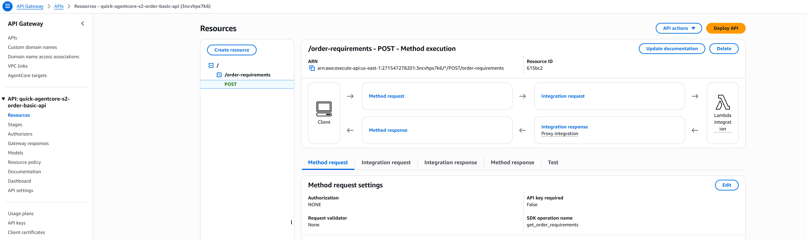

*图 20：场景二的订单 REST API 配置。*

**库存 API。** 模板使用 `AWS::ApiGatewayV2::Api`、payload 2.0 的 Lambda 代理集成，以及显式部署阶段。JWT authorizer 要求 issuer 为 `https://login.microsoftonline.com/<EntraTenantId>/v2.0`，audience 为 `InventoryApiApplicationId`。路由使用 `AuthorizationType=JWT`，不设置 `AuthorizationScopes`；app role 由库存函数校验。

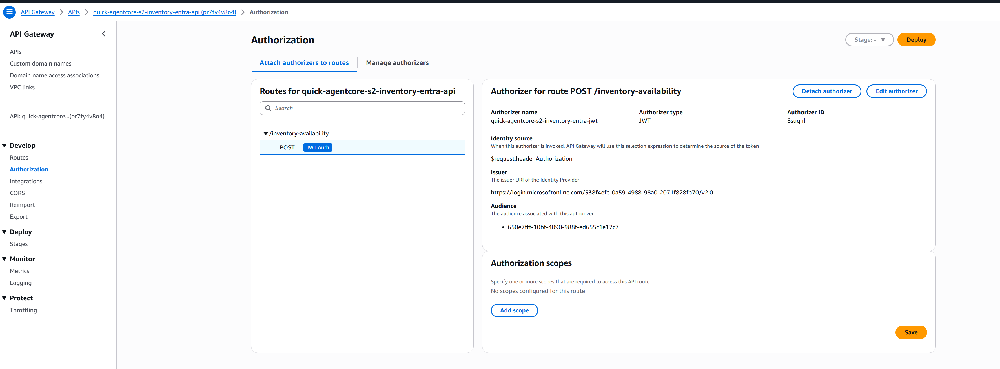

*图 21：场景二的库存 HTTP API JWT authorizer。*

stage variables 保存预期的 tenant、客户端和 app role。两个 API 的 Lambda 调用权限均限定到账号、API、阶段、方法和路径。其中 "expectedClientId" 为 `InventoryClientApplicationId`，"expectedTenantId" 为 `EntraTenantId`。

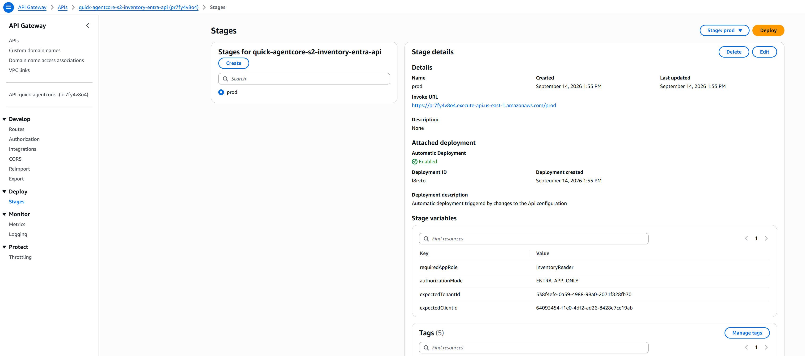

*图 22：场景二的库存 API stage variables。*

**Gateway target 与 credential provider。** 模板创建引用外部 Secrets Manager 凭据的 API 密钥 credential provider 和 `CustomOauth2` credential provider。库存 target 以 `CLIENT_CREDENTIALS` 请求 app-only access token。

两个 target 均通过显式 OpenAPI 定义接入：订单 target 注入 Basic 请求头，库存 target 注入 Entra ID Bearer token。工具输入定义声明必填字段，并禁止额外字段。

**订单 target。** "Outbound Auth configurations" 和 栈输出 `OrderCredentialProviderArn` 一致

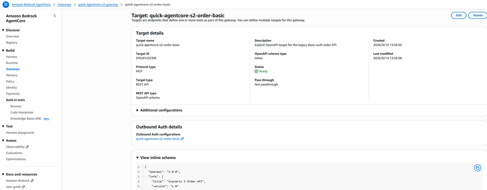

*图 23：场景二的订单 target 配置。*

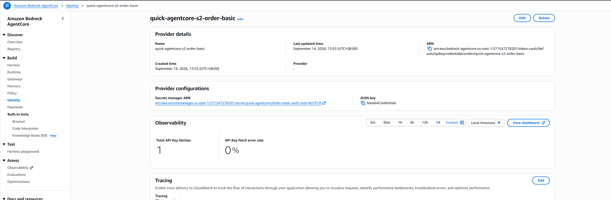

*图 24：场景二的订单 target 凭据配置。*

**库存 Target**。 "Outbound Auth configurations" 对应配置 `InventoryOAuthClientSecretArn` 参数以及栈输出的 `InventoryOAuthTokenScope`

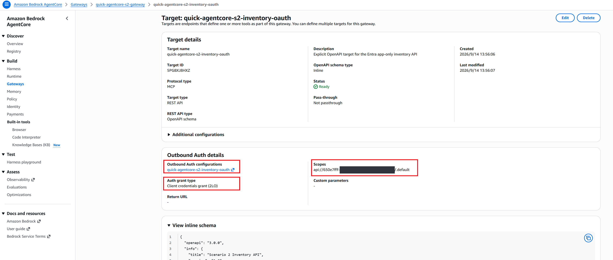

*图 25：场景二的库存 target 配置。*

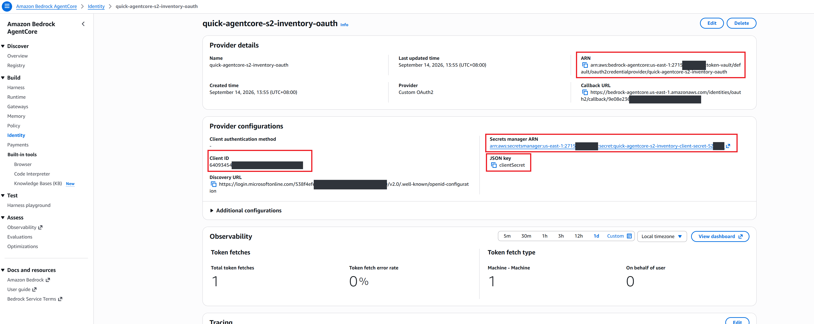

*图 26：场景二的库存 target 凭据配置。*

本示例选择 OpenAPI target 以配置所需的出站凭据。选择其他 target 类型时，应核对其支持的认证方式，参见 https://docs.aws.amazon.com/bedrock-agentcore/latest/devguide/gateway-outbound-auth.html。

除 Gateway、target 和入站 Cognito 输出外，还需记录以下输出。

| 输出 | 用途 |
| --- | --- |
| `OrderApiId`、`OrderApiBaseUrl` | 核对订单 REST API |
| `InventoryApiId`、`InventoryApiBaseUrl` | 核对库存 HTTP API |
| `OrderCredentialProviderArn`、`InventoryCredentialProviderArn` | 核对两个出站 credential provider |
| `InventoryEntraIssuer`、`InventoryOAuthTokenScope`、`InventoryRequiredAppRole` | 核对库存 API 的 issuer、scope 和 app role |

### 配置 Quick 连接器

连接器的配置方式与场景一相同，但所有字段均使用**场景二栈**的输出：`GatewayUrl`、`InboundClientId` 和 `InboundTokenEndpoint`。client secret 从场景二的 `InboundUserPoolId` 与 `InboundClientId` 对应 app client 读取。

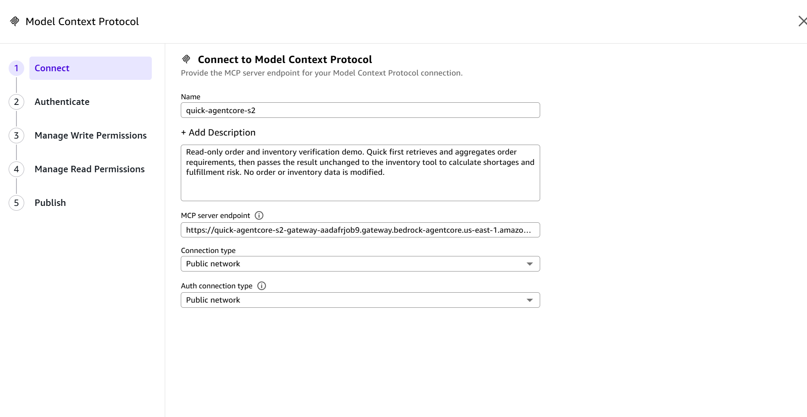

*图 27：场景二的连接器 MCP 端点配置。*

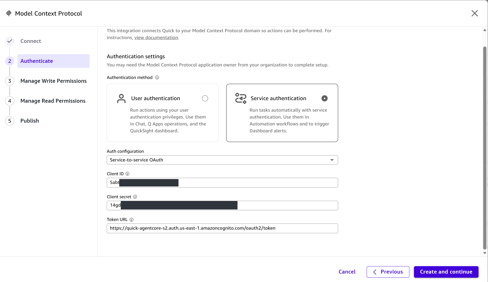

*图 28：场景二的连接器服务到服务 OAuth 配置。*

按组织策略选择共享范围，单击 **Publish** 发布连接器。

### 验证业务调用

在 Quick Desktop 的 **Capabilities → Browse more** 中启用名称以 `s2` 结尾的连接器，暂时禁用场景一连接器，避免同名业务工具影响验证。

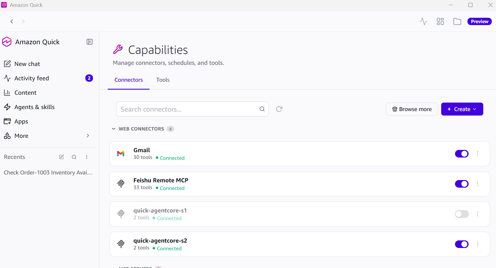

*图 29：在 Quick Desktop 中启用场景二连接器。*

使用场景一的订单查询请求。预期 Quick 通过 Basic 认证查询订单，再通过 Entra ID 应用身份查询库存。

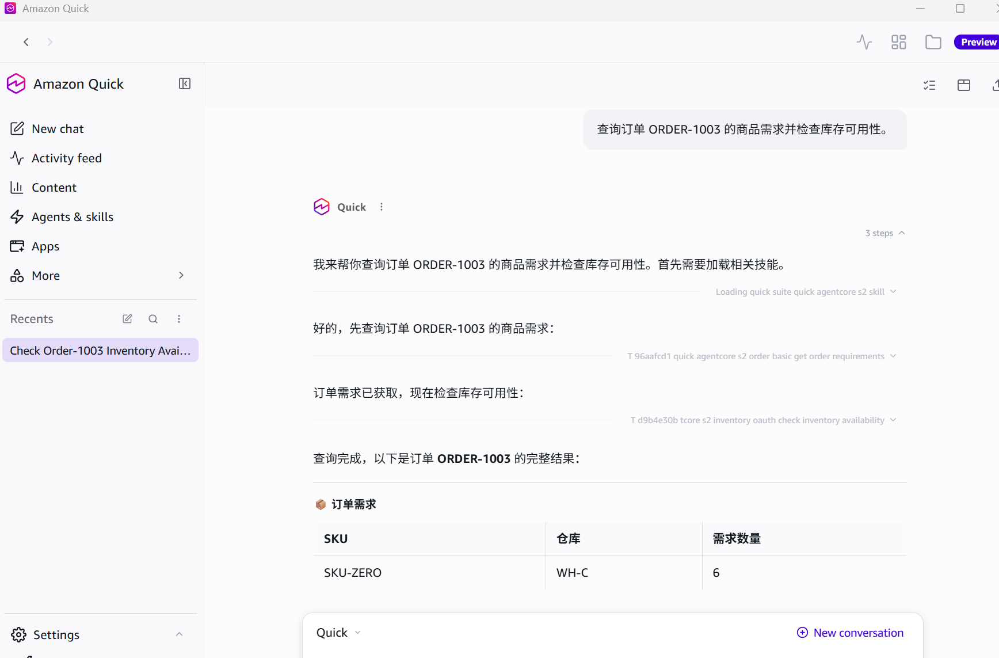

*图 30：场景二的订单与库存工具调用示例。*

## 场景三：通过 Entra ID OBO 传递用户身份

### 架构与安全设计

场景三适用于需要根据当前用户的业务角色授权的系统。用户已经通过 Entra ID SSO 登录 Quick，连接器还需要单独执行 authorization code flow，为 Gateway API 获取用户 access token。随后 Gateway 通过 OBO 换取两个下游 API 各自的 access token。

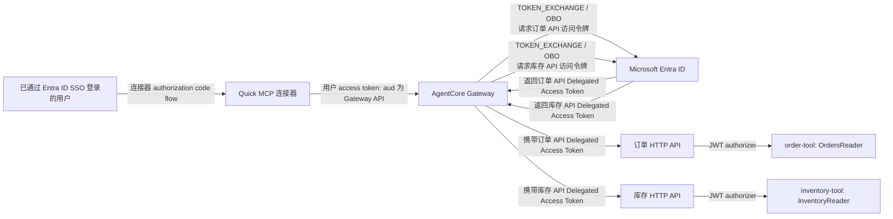
```mermaid
flowchart LR
    U[已通过 Entra ID SSO 登录的用户] -->|连接器 authorization code flow| Q[Quick MCP 连接器]
    Q -->|用户 access token: aud 为 Gateway API| G[AgentCore Gateway]

    G -->|TOKEN_EXCHANGE / OBO<br/>请求订单 API 访问令牌| E[Microsoft Entra ID]
    E -->|返回订单 API Delegated Access Token| G
    G -->|携带订单 API Delegated Access Token| OAPI[订单 HTTP API]

    G -->|TOKEN_EXCHANGE / OBO<br/>请求库存 API 访问令牌| E
    E -->|返回库存 API Delegated Access Token| G
    G -->|携带库存 API Delegated Access Token| IAPI[库存 HTTP API]

    OAPI -->|JWT authorizer| O[order-tool: OrdersReader]
    IAPI -->|JWT authorizer| I[inventory-tool: InventoryReader]
```

Gateway 的入站校验包括：issuer 属于指定 Entra ID tenant，audience 为 Gateway API 的 Application ID，scope 包含 `mcp.invoke`，`tid` 等于指定 tenant，`azp` 等于 Quick Client 的 Application ID。

两个下游 HTTP API 分别校验自己的 audience 和 route scope，业务函数随后校验可信 JWT claims 中的用户 app role：

| 下游 API | route scope | 用户 app role | 业务函数 |
| --- | --- | --- | --- |
| Order API | `Orders.Read` | `OrdersReader` | `order-tool` |
| Inventory API | `Inventory.Read` | `InventoryReader` | `inventory-tool` |

`Orders.Read` 和 `Inventory.Read` 是 delegated permissions，允许 Gateway 代表用户访问对应资源；`OrdersReader` 和 `InventoryReader` 是对应资源 API 定义并分配给用户的 app roles，表示该用户的业务访问资格。**scope 与 app role 分别校验，不能互相替代或跨资源复用。**

### 准备 Entra ID 应用与凭据

在同一个 Entra ID tenant 中完成四个应用注册。这些应用用于连接器到下游 API 的用户委托链，独立于既有的 Quick SSO。

| 应用 | 职责 | 暴露的 scope | client secret 用途 |
| --- | --- | --- | --- |
| Gateway API | 入站资源 API，同时作为执行 OBO 的机密中间层客户端（confidential middle-tier client） | `mcp.invoke` | 供 AgentCore Microsoft OAuth credential provider 执行 OBO |
| Quick Client | 机密 Web 客户端，为连接器获取 Gateway API 的用户 access token | 无 | 仅供 Quick 连接器执行 authorization code flow |
| Order API | 下游订单资源 API，定义用户 app role `OrdersReader` | `Orders.Read` | 本场景不需要 |
| Inventory API | 下游库存资源 API，定义用户 app role `InventoryReader` | `Inventory.Read` | 本场景不需要 |

> 本文的 **Application ID** 均指应用注册概览中的 **Application (client) ID**，不是 Object ID。client secret 必须使用 **Value**，不能使用 Secret ID。Quick Client 与 Gateway API 的 client secret 分别用于不同流程，不能混用。

#### 步骤 1：记录 tenant ID 与 Quick 回调地址

- 在 **Microsoft Entra admin center → Identity → Applications → App registrations** 中确认 **Directory (tenant) ID**，记录为 `<EntraTenantId>`。
- 记录 Quick 连接器配置页面提供的 Redirect URL。本示例形如 `https://<AWS_REGION>.quicksight.aws.amazon.com/sn/oauthcallback`。
- 四个应用注册均选择 **Accounts in this organizational directory only**。若对应企业应用启用了 **Assignment required**，按组织策略完成测试用户或用户组分配。

#### 步骤 2：注册 Gateway API

注册名为 `Gateway API` 的应用，在应用清单中将 `api.requestedAccessTokenVersion` 设置为 `2`。

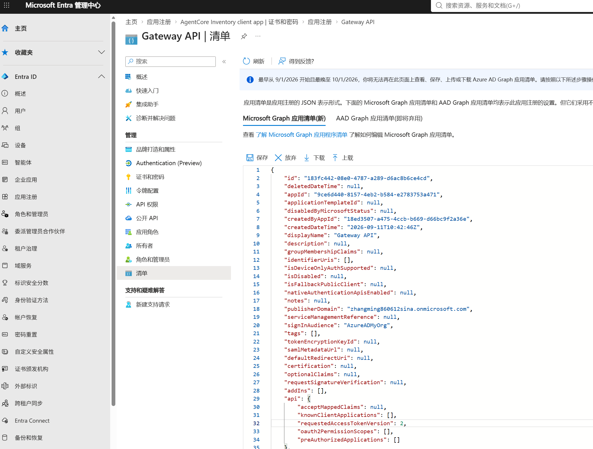

*图 31：Gateway API 的 access token 版本配置。*

设置 **Application ID URI** 为 `api://<GatewayApiApplicationId>`。

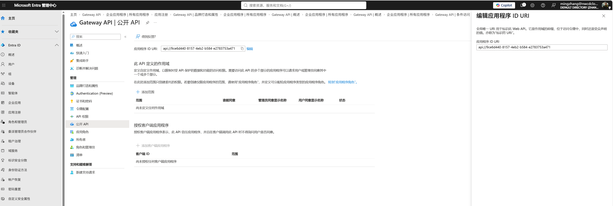

*图 32：Gateway API 的 Application ID URI。*

在 **Expose an API** 中创建并启用 `mcp.invoke` scope，完整 URI 为 `api://<GatewayApiApplicationId>/mcp.invoke`。

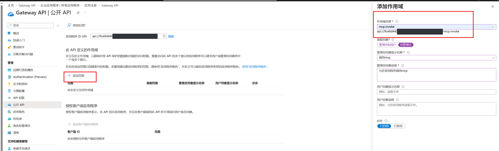

*图 33：Gateway API 的 mcp.invoke scope。*

创建 Gateway API 的 client secret，按组织策略设置有效期并保存其 **Value**。后续由 AgentCore Microsoft OAuth credential provider 使用该应用的 ID 和 client secret 执行 OBO。

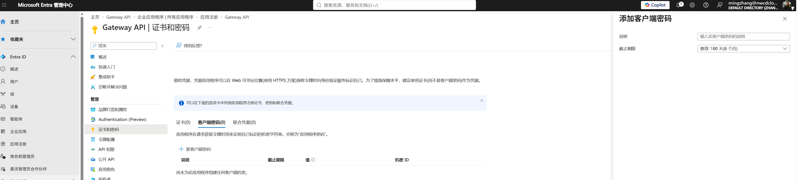

*图 34：创建 Gateway API 的 OBO client secret。*

#### 步骤 3：注册两个下游资源 API

分别注册 `Order API` 和 `Inventory API`，按以下表格完成配置。scope 名称和 app role 值区分大小写。

| 配置 | Order API | Inventory API |
| --- | --- | --- |
| Application (client) ID | 记录为 `<OrderApiApplicationId>` | 记录为 `<InventoryApiApplicationId>` |
| Application ID URI | `api://<OrderApiApplicationId>` | `api://<InventoryApiApplicationId>` |
| `api.requestedAccessTokenVersion` | `2` | `2` |
| delegated scope | `Orders.Read`，状态为 Enabled | `Inventory.Read`，状态为 Enabled |
| 完整 scope URI | `api://<OrderApiApplicationId>/Orders.Read` | `api://<InventoryApiApplicationId>/Inventory.Read` |
| 用户 app role | `OrdersReader`，成员类型为 Users/Groups，状态为 Enabled | `InventoryReader`，成员类型为 Users/Groups，状态为 Enabled |

订单资源 API 的配置示例如下。

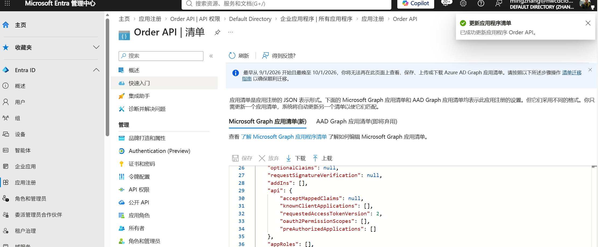

*图 35：Order API 的 access token 版本配置。*

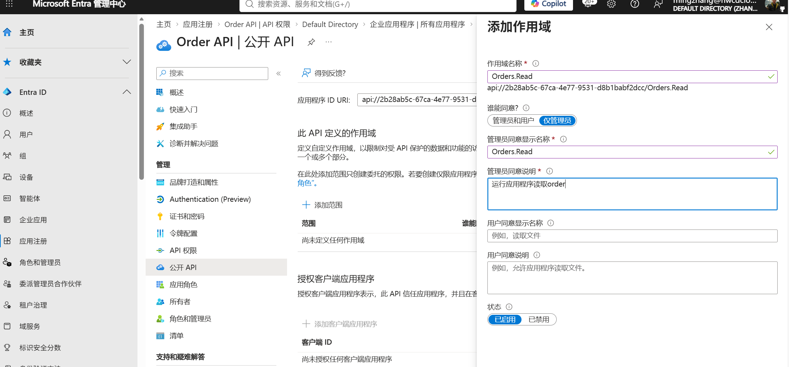

*图 36：Order API 的 Orders.Read delegated scope。*

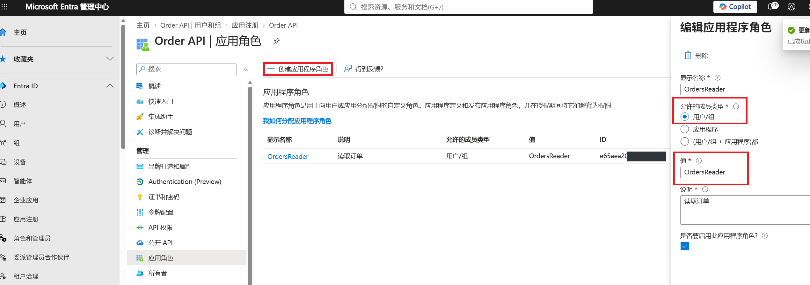

*图 37：Order API 的 OrdersReader 用户 app role。*

库存资源 API 的配置示例如下。

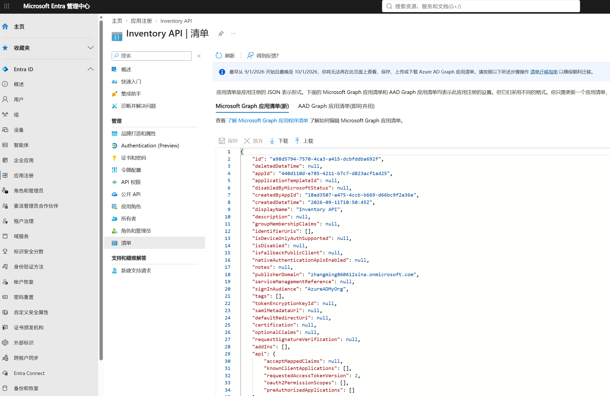

*图 38：Inventory API 的 access token 版本配置。*

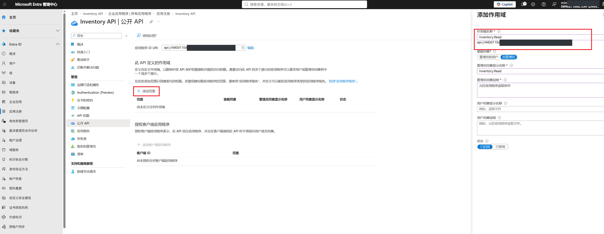

*图 39：Inventory API 的 Inventory.Read delegated scope。*

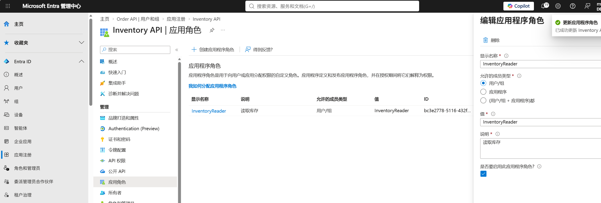

*图 40：Inventory API 的 InventoryReader 用户 app role。*

场景二的 `InventoryReader` 面向应用身份，成员类型为 **Applications**；本场景的同名角色面向用户身份，成员类型为 **Users/Groups**。配置时应核对所属应用和成员类型。

#### 步骤 4：为 Gateway API 添加下游 delegated permissions

在 Gateway API 的 **API permissions** 中，分别添加 Order API 的 `Orders.Read` 和 Inventory API 的 `Inventory.Read` delegated permissions，并授予管理员同意。

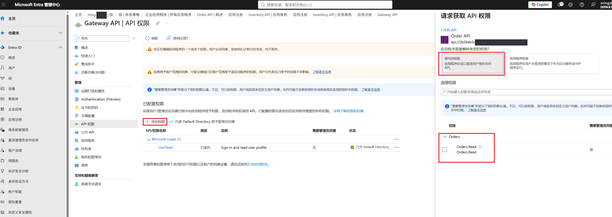

*图 41：为 Gateway API 添加 Orders.Read delegated permission。*

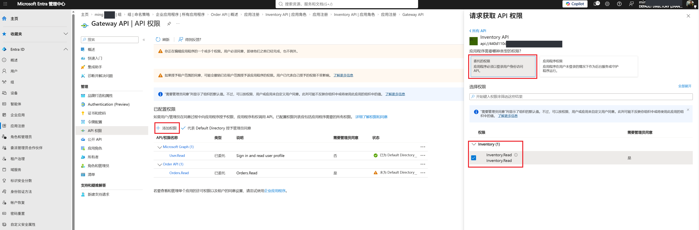

*图 42：为 Gateway API 添加 Inventory.Read delegated permission。*

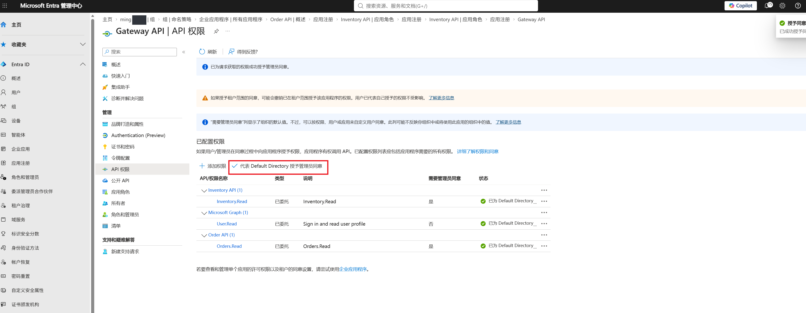

*图 43：为 Gateway API 的下游 delegated permissions 授予管理员同意。*

#### 步骤 5：注册 Quick Client

注册名为 `Quick Client` 的应用，在 **Authentication → Add a platform → Web** 中添加步骤 1 记录的 Redirect URL。本场景使用带 client secret 的 authorization code flow，因此选择 Web 平台，不启用 implicit grant。重定向 URI 使用模板  https://<REGION>.quicksight.aws.amazon.com/sn/oauthcallback, 其中 `REGION` 为 Quick 开通所在的 AWS 区域。

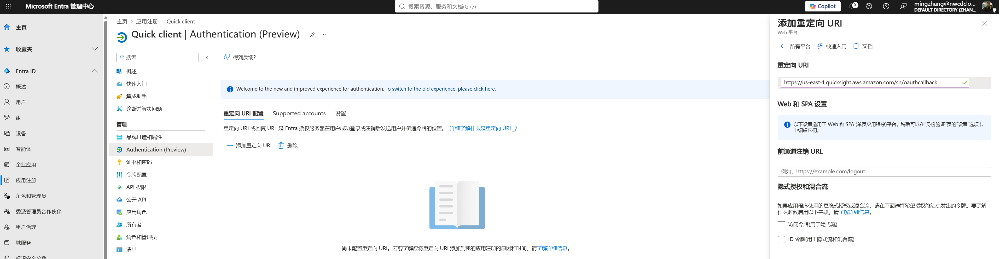

*图 44：Quick Client 的 Web 回调地址配置。*

在 **Certificates & secrets → New client secret** 中创建 Quick Client 自己的 client secret，保存其 **Value**，稍后仅填入 Quick 连接器。

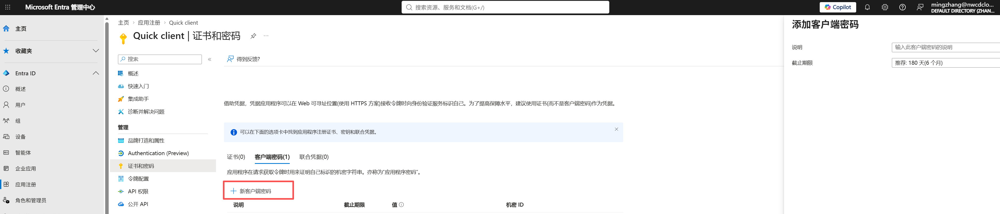

*图 45：创建 Quick Client 的 client secret。*

在 **API permissions → Add a permission → My APIs → Gateway API → Delegated permissions** 中选择 `mcp.invoke`，并按组织策略完成管理员同意。

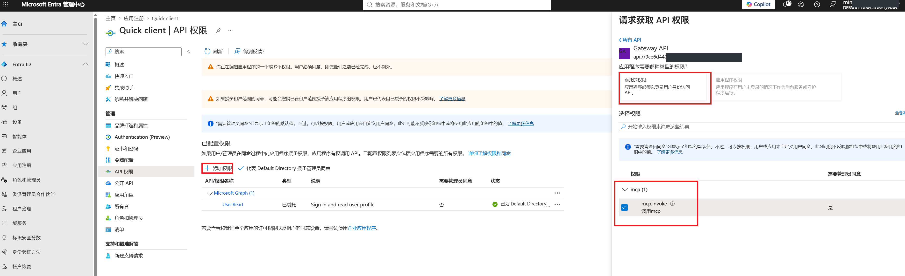

*图 46：为 Quick Client 添加 mcp.invoke delegated permission。*

#### 步骤 6：为测试用户分配业务角色

在对应资源 API 的 **Enterprise applications → Users and groups** 中分配角色：

- 为获准查询订单的用户或组分配 Order API 的 `OrdersReader`。
- 为获准查询库存的用户或组分配 Inventory API 的 `InventoryReader`。

截图展示两组用户的角色配置：一组具备订单和库存角色，另一组未分配这两个角色。

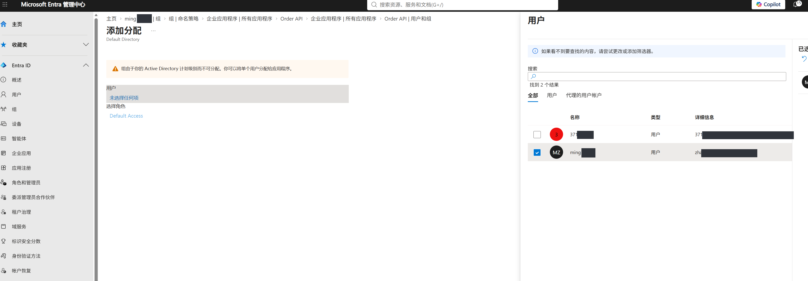

*图 47：Order API 的用户角色分配示例（一）。*

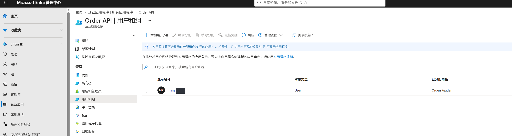

*图 48：Order API 的用户角色分配示例（二）。*

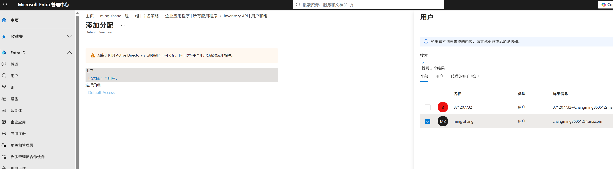

*图 49：Inventory API 的用户角色分配示例（一）。*

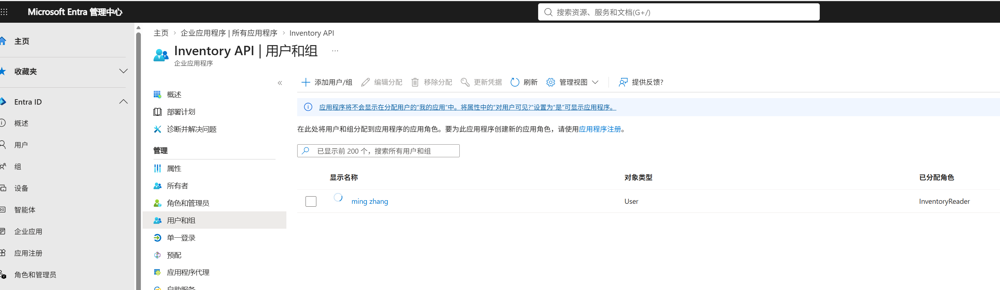

*图 50：Inventory API 的用户角色分配示例（二）。*

也可以设计更丰富的场景，比如增加“仅库存权限”的测试用户，用于验证两个业务域的权限能够独立生效。

#### 步骤 7：保存 Gateway OBO client secret

将步骤 2 创建的 Gateway API client secret 存入 Secrets Manager，记录返回的 ARN。此处使用 Gateway API 的 client secret；Quick Client 的 client secret 仅用于连接器配置。

```bash
aws secretsmanager create-secret \
  --name quick-agentcore-s3-gateway-obo \
  --secret-string '{"clientSecret":"<Gateway API client secret Value>"}' \
  --region "$AWS_REGION"
```

### 部署场景

使用 `scenario3.example.json` 准备参数，并部署 `scenario3`。

| 参数 | 值与来源 |
| --- | --- |
| `Prefix` | 资源名前缀，例如 `quick-agentcore-s3` |
| `OrderToolLambdaArn`、`InventoryToolLambdaArn` | 预部署 `order-tool` 与 `inventory-tool` 的 ARN，账号、区域及函数名需符合模板约束 |
| `EntraTenantId` | 步骤 1 记录的 Directory (tenant) ID |
| `GatewayApiApplicationId` | 步骤 2 的 Gateway API Application ID |
| `QuickClientApplicationId` | 步骤 5 的 Quick Client Application ID，用于约束入站 token 的 `azp` |
| `OrderApiApplicationId`、`InventoryApiApplicationId` | 步骤 3 的两个资源 API Application ID，分别作为对应 HTTP API 的 JWT audience |
| `GatewayInboundScope` | 固定短名称 `mcp.invoke`，不填完整 scope URI |
| `OrderRequiredRole`、`InventoryRequiredRole` | 分别固定为 `OrdersReader` 和 `InventoryReader` |
| `GatewayOboClientSecretArn` | 步骤 7 返回的 Secrets Manager ARN |
| `GatewayOboClientSecretJsonKey` | 固定为 `clientSecret` |
| `StageName` | 两个 HTTP API 的显式 stage，默认 `prod`；模板不创建 `$default` stage |

模板根据两个资源 API Application ID 生成完整的 `Orders.Read` 和 `Inventory.Read` scope URI。参数文件只保存 ID、ARN 和 JSON key 等配置，不保存 client secret Value。

部署前核对四个 Application ID 互不相同，并确认没有把 Object ID、Secret ID 或完整 scope URI 填入不对应的字段。

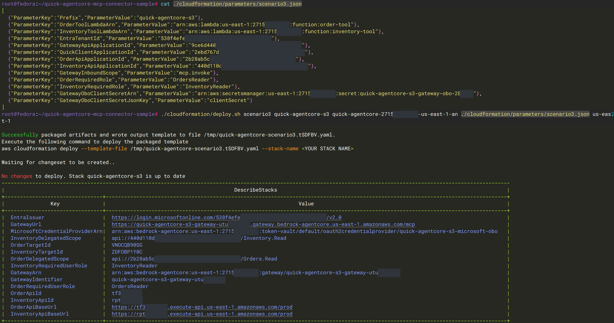

*图 51：场景三的部署参数与命令。*

部署后，重点核对以下资源。

**两个下游 HTTP API。** 两者使用 Lambda proxy payload 2.0 和原生 JWT authorizer。issuer 相同，audience 分别对应各自的资源 API。每条路由要求对应的 scope，Lambda 调用权限限定到对应 API 的阶段、方法和路径。

**订单 API。** "Audience" 和 `OrderApiApplicationId` 参数一致

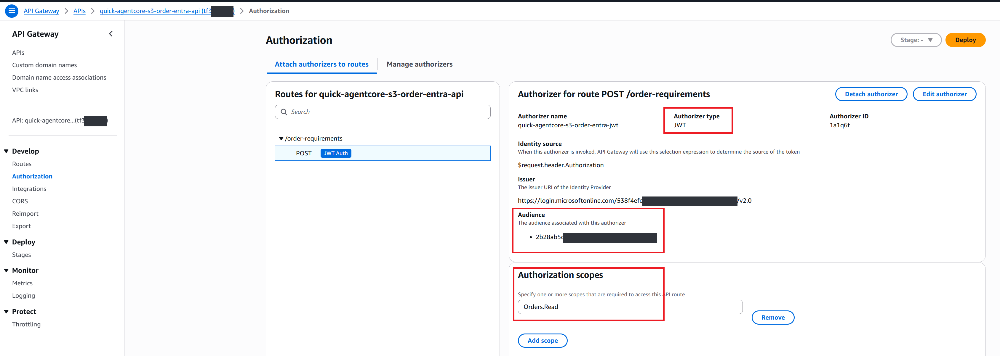

*图 52：场景三的订单 HTTP API JWT authorizer。*

**库存 API**。"Audience" 和 `InventoryApiApplicationId` 参数一致

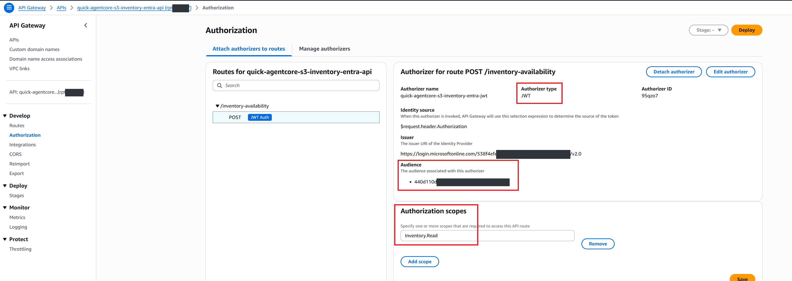

*图 53：场景三的库存 HTTP API JWT authorizer。*

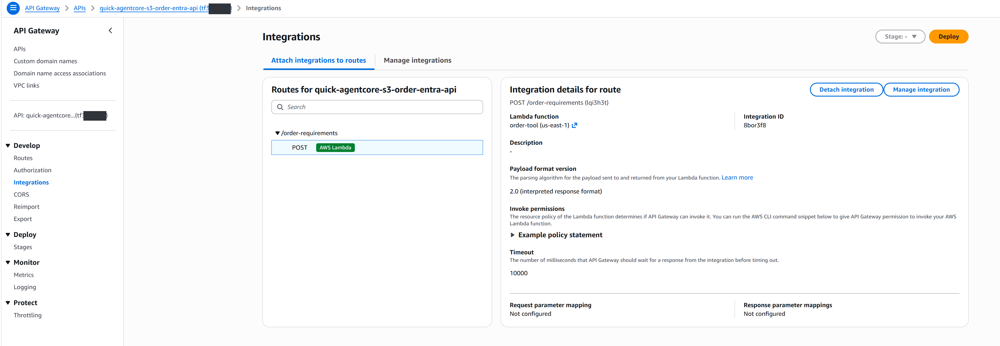

*图 54：场景三的订单 API route scope。*

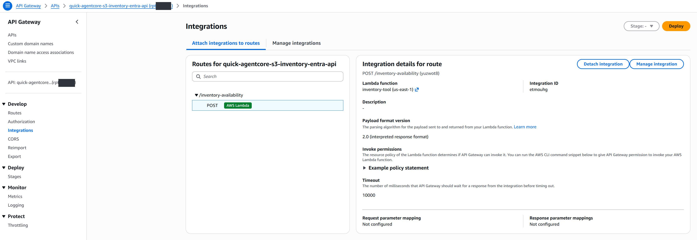

*图 55：场景三的库存 API route scope。*

订单 API 和库存 API 两个 **API Gateway stage** 的 `authorizationMode` 均为 `ENTRA_DELEGATED_USER_ROLE`，`expectedAuthorizedParty` 均为 Gateway API Application ID。订单 stage 的 `requiredUserRole` 为 `OrdersReader`，库存 stage 的值为 `InventoryReader`。

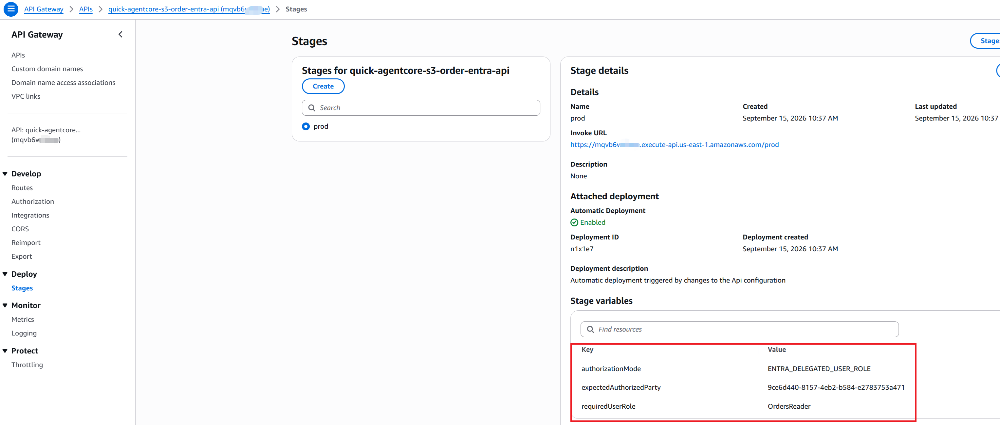

*图 56：场景三的订单 API stage variables。*

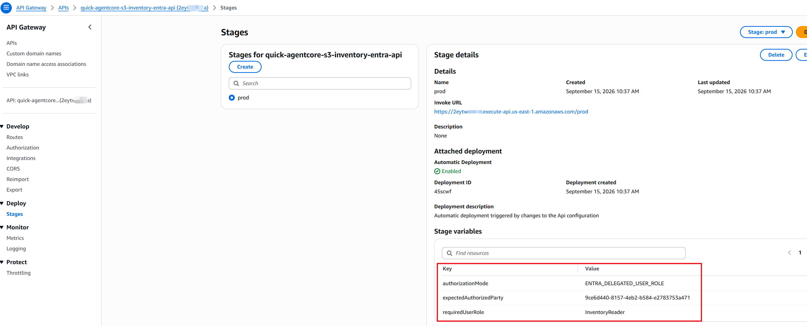

*图 57：场景三的库存 API stage variables。*

**Gateway 出站 OBO 配置。** Microsoft OAuth credential provider 引用外部 Secrets Manager client secret，即 `GatewayOboClientSecretArn` 参数。两个 OpenAPI target 使用 `TOKEN_EXCHANGE`，分别请求 `api://<OrderApiApplicationId>/Orders.Read` 和 `api://<InventoryApiApplicationId>/Inventory.Read`。

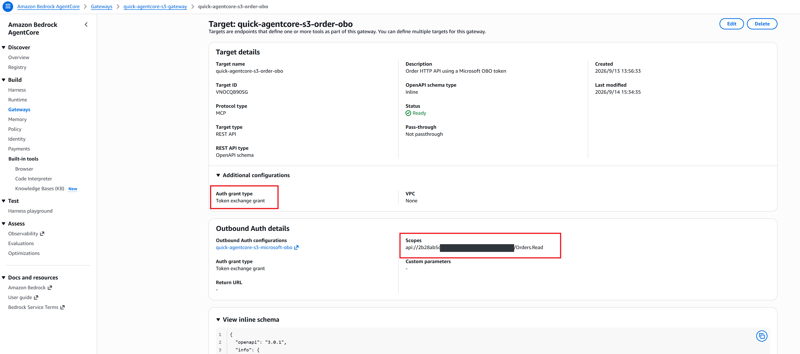

*图 58：场景三的订单 OpenAPI target 与 OBO 配置。*

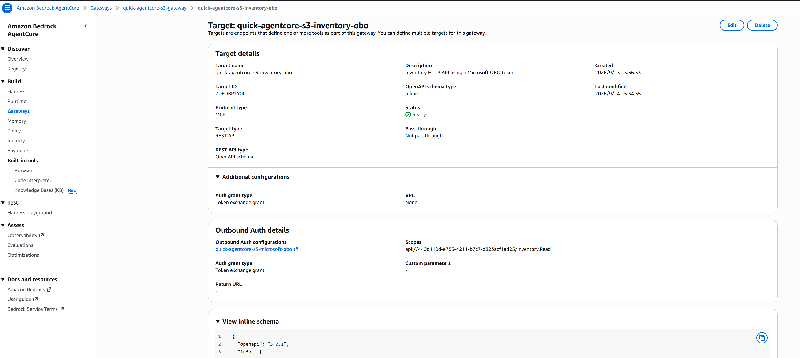

*图 59：场景三的库存 OpenAPI target 与 OBO 配置。*

**Gateway 入站配置。** 核对:

- Entra ID issuer
- Gateway audience 与 `GatewayApiApplicationId` 参数保持一致
- `mcp.invoke` scope
- `tid` 与 `EntraTenantId` 参数保持一致
- `azp` claim 与 `QuickClientApplicationId` 保持一致

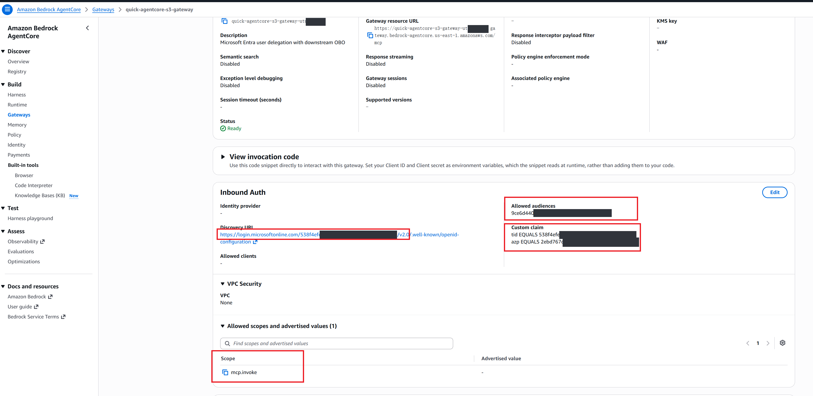

*图 60：场景三的 Gateway 入站 JWT 配置。*

栈输出包括 Gateway ARN、ID、URL，两个 target ID，两个 HTTP API 的 ID 和 URL，Microsoft OAuth credential provider ARN、Entra ID issuer、两个完整 delegated scope URI，以及 `OrderRequiredUserRole` 和 `InventoryRequiredUserRole`。输出不包含 client secret 或用户 token。

### 配置 Quick 连接器

先将栈输出的 `GatewayUrl` 加入 Gateway API 应用注册的 `identifierUris`，用于匹配连接器发送的 MCP resource URI。

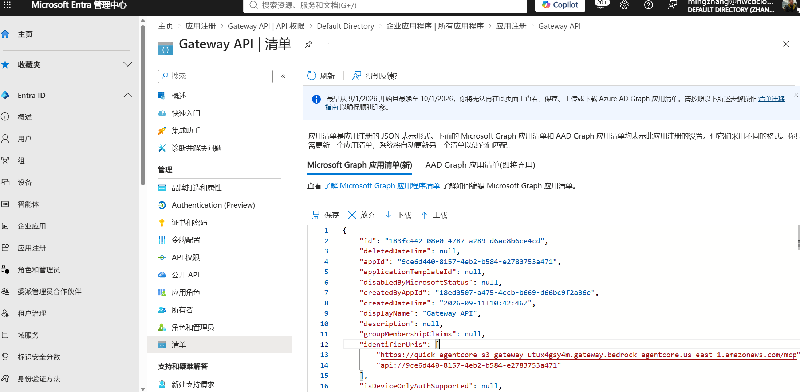

*图 61：将 Gateway URL 添加到 Gateway API 的 identifierUris。*

在 Quick 中创建 MCP 连接器，并填写以下字段。

| 连接器字段 | 配置值 |
| --- | --- |
| MCP server endpoint | 栈输出 `GatewayUrl` |
| 认证方式 | 自定义的基于用户的 OAuth，即 authorization code flow |
| Client ID | Quick Client 的 Application ID |
| Client secret | Quick Client 的 client secret Value |
| Authorization URL | `https://login.microsoftonline.com/<EntraTenantId>/oauth2/authorize` |
| Token URL | `https://login.microsoftonline.com/<EntraTenantId>/oauth2/token` |
| Scope | `openid profile offline_access api://<GatewayApiApplicationId>/mcp.invoke` |
| Redirect URL | 前文注册到 Quick Client 的 Quick 回调地址，页面自动生成不用填写 |

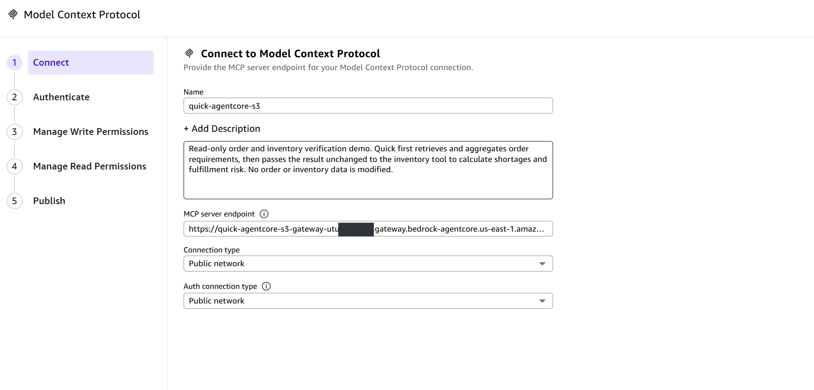

*图 62：场景三的连接器 MCP 端点配置。*

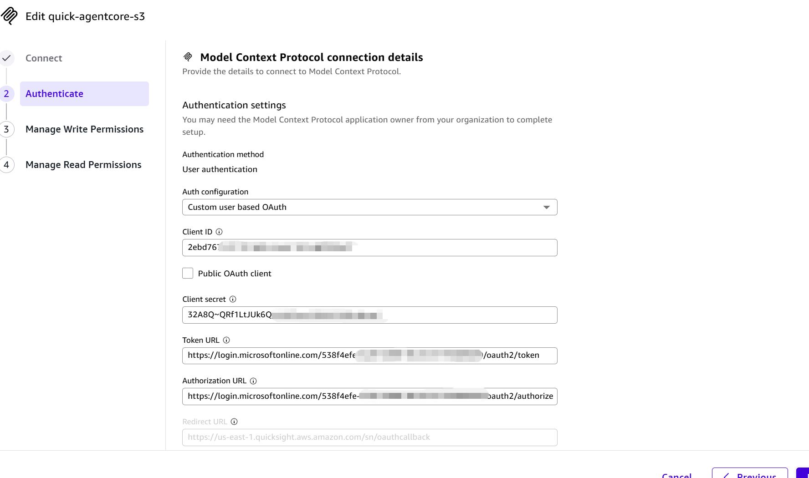

*图 63：场景三的连接器用户 OAuth 配置。*

按 Quick 提示完成登录和用户授权。

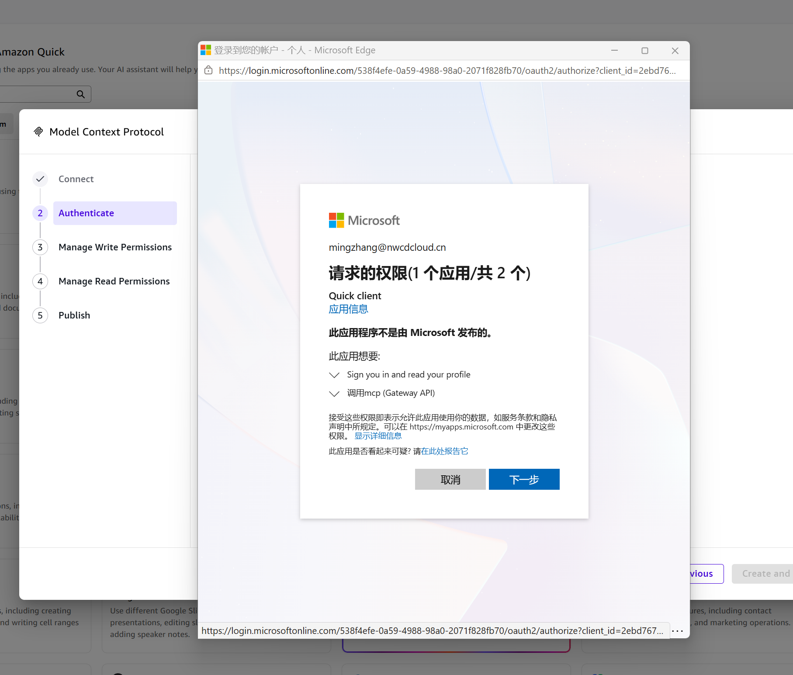

*图 64：场景三的用户登录与授权示例（一）。*

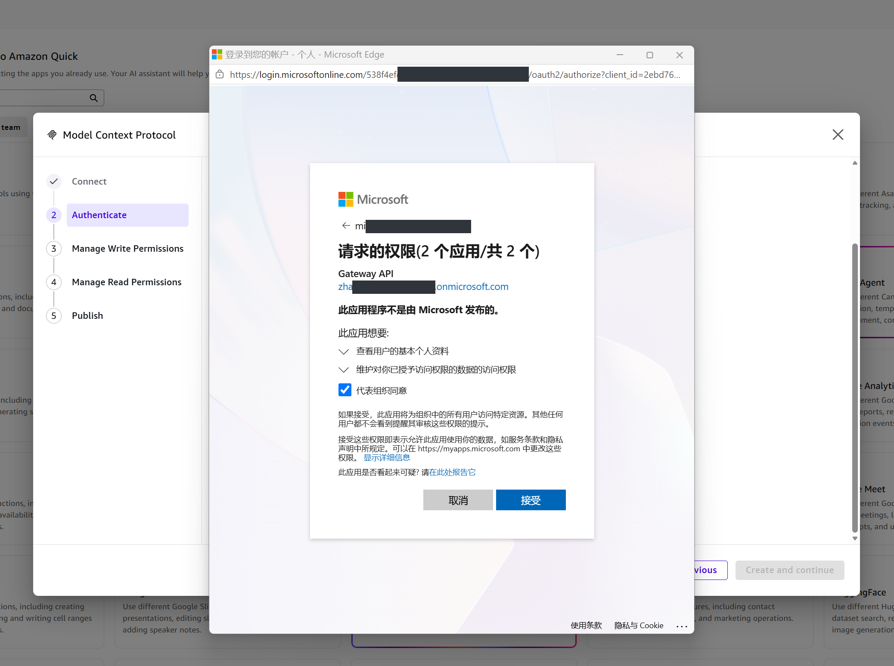

*图 65：场景三的用户登录与授权示例（二）。*

按组织策略设置共享范围，单击 **Publish**。连接器的可见范围与下游业务角色分别控制；能看到连接器，不代表拥有订单或库存访问权限。

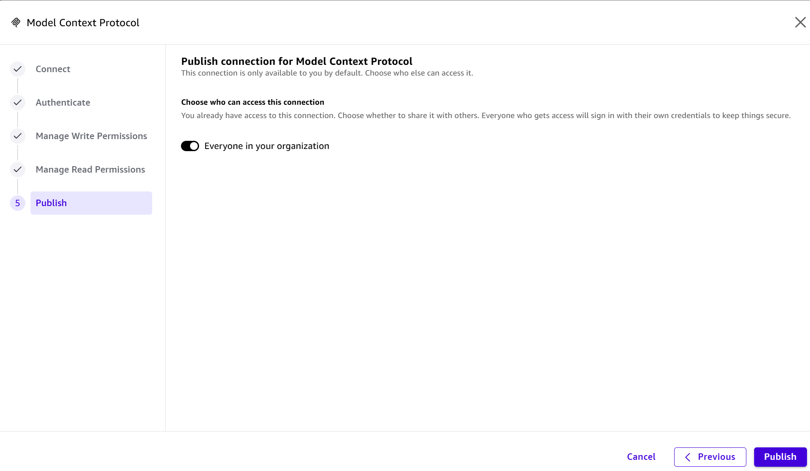

*图 66：发布场景三连接器。*

### 验证用户权限

在 Quick Desktop 的 **Capabilities → Browse more** 中启用名称以 `s3` 结尾的连接器，暂时禁用场景一和场景二连接器。

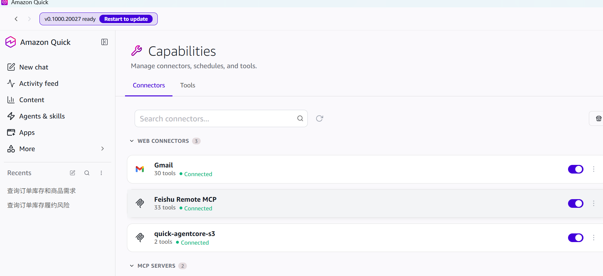

*图 67：在 Quick Desktop 中启用场景三连接器。*

让不同权限的用户分别完成连接器登录，验证以下结果。

| 用户权限 | 订单工具预期结果 | 库存工具预期结果 |
| --- | --- | --- |
| 同时具备两个 Reader app role | 允许访问 | 允许访问 |
| 仅具备 `InventoryReader` | 拒绝访问 | 在提供有效库存工具输入时允许访问 |
| 两个 Reader app role 均未分配 | 拒绝访问 | 拒绝访问 |

具备两个角色的用户使用前述订单查询请求时，应能够依次调用订单与库存工具。

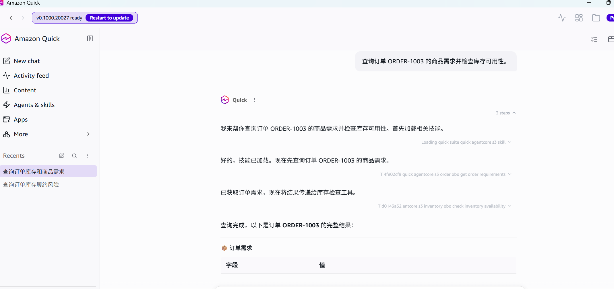

*图 68：场景三中已授权用户的业务调用示例。*

未分配业务角色的用户即使能够看到连接器并完成 **Sign in**，仍不能取得对应业务数据。

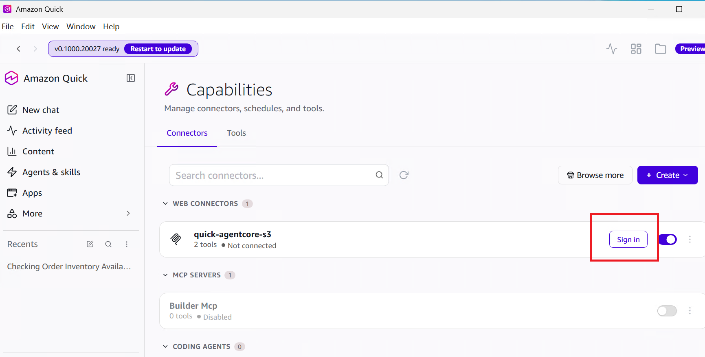

*图 69：场景三中未授权用户的连接器登录示例。*

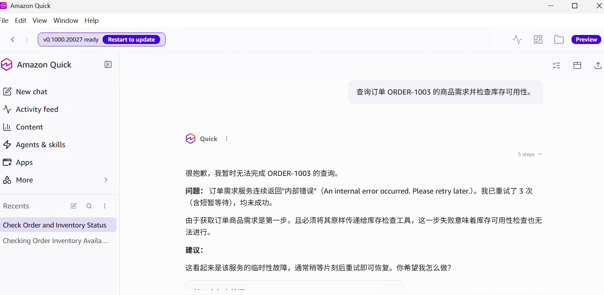

*图 70：场景三中未授权用户的访问拒绝示例。*

### 扩展到更细粒度的业务授权

如需按数据行或字段控制访问，业务函数可以从已经由 API Gateway 验证的 JWT claims 中读取 `tid` 和 `oid`，结合业务权限数据定位到具体的用户并实施授权。继续沿用可信 authorizer claims 作为身份来源，避免直接信任调用方提交的身份字段。

## 场景四：通过 Gateway PrivateLink 调用 VPC 内的 Lambda 工具

### 架构与安全设计

场景四适用于需要通过私网访问 Gateway，并将业务函数部署在 VPC 内的情况。连接器通过 Quick VPC 连接和 AWS PrivateLink 访问 Gateway，Gateway 使用 IAM 调用场景专属的订单与库存 Lambda 函数。两个函数沿用前文的业务逻辑，并配置到本场景的私有子网中。

本场景参考场景一使用 Cognito client credentials flow 作为入站认证方式。工具调用和 OAuth token 请求使用各自的网络路径：前者经过 Gateway interface VPC endpoint，后者访问公共 Cognito user-pool domain 的 `/oauth2/token`。

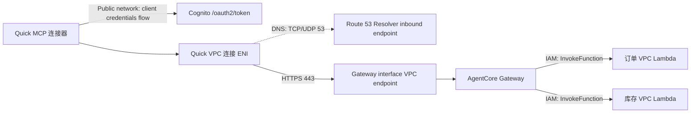
```mermaid
flowchart LR
    Q[Quick MCP 连接器]
    Q -->|Public network: client credentials flow| C[Cognito /oauth2/token]
    Q --> E[Quick VPC 连接 ENI]
    E -.->|DNS: TCP/UDP 53| R[Route 53 Resolver inbound endpoint]
    E -->|HTTPS 443| V[Gateway interface VPC endpoint]
    V --> G[AgentCore Gateway]
    G -->|IAM: InvokeFunction| O[订单 VPC Lambda]
    G -->|IAM: InvokeFunction| I[库存 VPC Lambda]
```

Quick 支持分别配置 resource-server VPC connection（`VpcConnectionArn`）和 auth-server VPC connection（`AuthVpcConnectionArn`），用于承载 MCP 流量和 OAuth 流量。如果授权服务器提供可从 VPC 访问的 OAuth endpoint，可以独立配置其 auth-server VPC connection。具体配置见https://docs.aws.amazon.com/quick/latest/userguide/mcp-integration.html。**本场景的 auth-server 保持 Public network，是由 Cognito user-pool domain 的访问方式决定的。** Cognito 的 domain OAuth endpoint、managed login 和 hosted UI 不支持通过 Cognito PrivateLink 访问，`cognito-idp` interface endpoint 也不接收 user-pool domain 请求。因此，本示例的 `/oauth2/token` 继续使用公共网络路径。相关限制见https://docs.aws.amazon.com/cognito/latest/developerguide/vpc-interface-endpoints.html。

Quick VPC 连接通过 Route 53 Resolver 解析 Gateway 域名；启用 private DNS 后，MCP 请求通过 Gateway interface VPC endpoint 到达服务。endpoint policy 仅允许对当前 Gateway ARN 执行 `bedrock-agentcore:InvokeGateway`，Gateway 的 JWT authorizer 则继续校验 Cognito token。

Quick、Resolver、Gateway VPC endpoint 和业务 Lambda 分别使用独立安全组，网络规则如下。

| 安全组 | 允许的流量 | 用途 |
| --- | --- | --- |
| Quick ENI | 向 Resolver 发送 TCP/53、UDP/53 请求；向 Gateway VPC endpoint 发送 TCP/443 请求 | DNS 解析与 MCP 调用 |
| Resolver | 接收来自 Quick ENI 的 TCP/53、UDP/53 请求 | 解析 Gateway 域名 |
| Gateway VPC endpoint | 接收来自 Quick ENI 的 TCP/443 请求 | 通过 PrivateLink 访问 Gateway |
| 业务 Lambda | 不配置入站或出站放行规则 | 仅满足演示，其无需访问外部网络 |

Gateway 通过 Lambda 服务的调用接口执行函数，并使用 execution role 授权。Lambda 的 VPC 配置用于函数运行时的网络访问，因此业务安全组无需为 Gateway 开放入站端口。

### 部署场景

使用 `scenario4.example.json` 准备参数，并按通用步骤部署 `scenario4`。场景栈从共享业务源码打包，创建 `<Prefix>-order-vpc-tool` 和 `<Prefix>-inventory-vpc-tool` 两个专属函数，因此无需填写外部业务 Lambda ARN。

| 参数 | 说明 |
| --- | --- |
| `Prefix` | 场景专属资源名前缀，例如 `quick-agentcore-s4` |
| `CognitoDomainPrefix` | 区域内唯一的 Cognito 托管域名前缀 |
| `GatewayScopeIdentifier` | Gateway 对应的 Cognito resource server identifier；模板追加 `/invoke` |
| `QuickVpcConnectionId` | Quick VPC 连接的唯一 ID；重新创建时使用新值，避免复用近期删除的连接 ID |
| `VpcCidr` | 专属 VPC CIDR，默认 `10.77.0.0/16` |
| `SubnetCidrA`、`SubnetCidrB` | 两个不同可用区的私有子网 CIDR，默认 `10.77.1.0/24`、`10.77.2.0/24` |
| `ResolverIpAddressA`、`ResolverIpAddressB` | 对应子网内的 Resolver 固定 IP，默认 `10.77.1.10`、`10.77.2.10` |

部署前确认 CIDR 与现有网络无冲突，两个 Resolver IP 位于各自子网内且未被占用。下图使用 `10.78.0.0/16` 作为演示网段，实际部署时应根据环境填写。

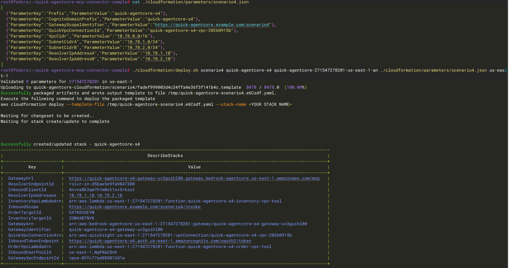

*图 71：场景四的部署参数、命令与栈输出。*

部署完成后，可以在控制台核对以下资源。

**Cognito 入站身份与 Gateway。** 场景栈创建独立的 Cognito 用户池、resource server、app client 和托管域名，以及使用 `CUSTOM_JWT` 的 Gateway。两个原生 Lambda target 使用 `GATEWAY_IAM_ROLE`，Gateway execution role 的调用权限限定到本场景的两个函数 ARN。

**私网访问资源。** 模板创建 VPC、两个私有子网、Route 53 Resolver inbound endpoint、Gateway interface VPC endpoint，以及 Quick VPC 连接。Gateway endpoint 的服务名为 `com.amazonaws.<AWS_REGION>.bedrock-agentcore.gateway`，并启用 private DNS。

**专属 VPC Lambda。** 两个业务函数配置到本场景的私有子网，使用专属的业务安全组和 execution role。它们由场景四栈管理，随栈创建和删除；场景一至三继续使用各自引用的共享业务函数。

记录以下栈输出，供连接器配置和资源核对使用。

| 输出 | 用途 |
| --- | --- |
| `GatewayArn`、`GatewayIdentifier`、`GatewayUrl` | 核对 Gateway 资源并配置 MCP endpoint |
| `OrderTargetId`、`InventoryTargetId` | 核对两个 Gateway target 的状态 |
| `OrderVpcLambdaArn`、`InventoryVpcLambdaArn` | 定位两个专属业务函数，检查 VPC 配置 |
| `InboundUserPoolId`、`InboundClientId` | 定位 Cognito 用户池和 app client，读取对应 client secret |
| `InboundScope`、`InboundTokenEndpoint` | 配置 OAuth scope 和 token endpoint |
| `QuickVpcConnectionArn` | 配置连接器的 resource-server VPC connection |
| `GatewayVpcEndpointId` | 核对 Gateway endpoint 状态、private DNS 和 endpoint policy |
| `ResolverEndpointId`、`ResolverIpAddresses` | 核对 DNS 解析资源与 Quick VPC 连接的 DNS 配置 |

### 配置 Quick 连接器

在 Quick 中创建 MCP 连接器，使用场景四栈的输出填写以下字段。

| 连接器字段 | 配置值 |
| --- | --- |
| MCP server endpoint | 栈输出 `GatewayUrl` |
| 认证方式 | 服务到服务 OAuth，即 client credentials flow |
| Client ID | 栈输出 `InboundClientId` |
| Client secret | `InboundUserPoolId` 对应的 Cognito 用户池中，`InboundClientId` 对应 app client 的 client secret |
| Token URL | 栈输出 `InboundTokenEndpoint`，即公共 Cognito domain 的 token endpoint |
| Scope | 栈输出 `InboundScope` |
| Connection type（resource-server） | 选择栈输出 `QuickVpcConnectionArn` 对应的 VPC 连接 |
| Auth connection type（auth-server） | **Public network** |

在 **Connect** 页面，填写 `GatewayUrl`，并将 **Connection type** 设置为本场景创建的 Quick VPC 连接；**Auth connection type** 保持 **Public network**。连接器继续使用标准 Gateway URL，由 VPC 连接中的 DNS 配置完成私网解析。

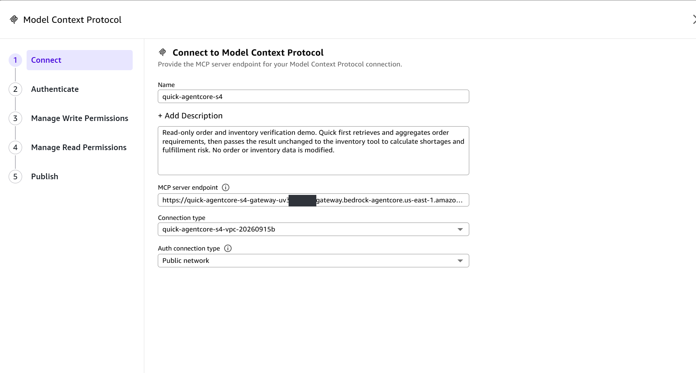

*图 72：为 MCP 调用选择 VPC 连接，为 Cognito OAuth 保留 Public network。*

在 **Authenticate** 页面选择 **Service-to-service OAuth**，填写本场景的 Client ID、Client secret 和 Token URL。

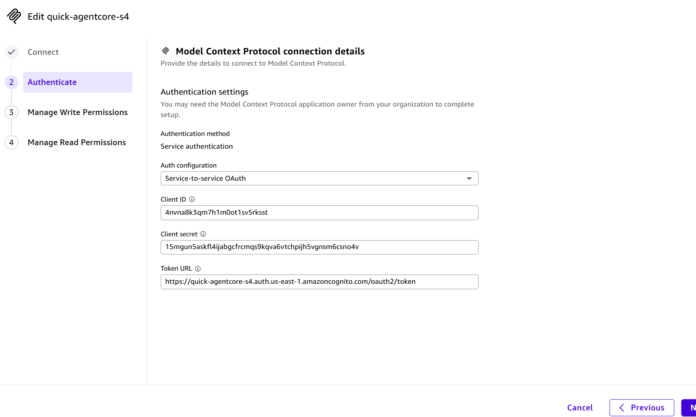

*图 73：场景四的连接器服务到服务 OAuth 配置。*

按组织策略选择连接器的共享范围，单击 **Publish** 发布。发布后，确认连接器包含订单和库存两个只读工具。

### 验证业务调用

在 Quick Desktop 中打开 **Capabilities → Browse more**，启用名称以 `s4` 结尾的连接器，暂时禁用场景一至三的连接器，避免同名业务工具影响验证。

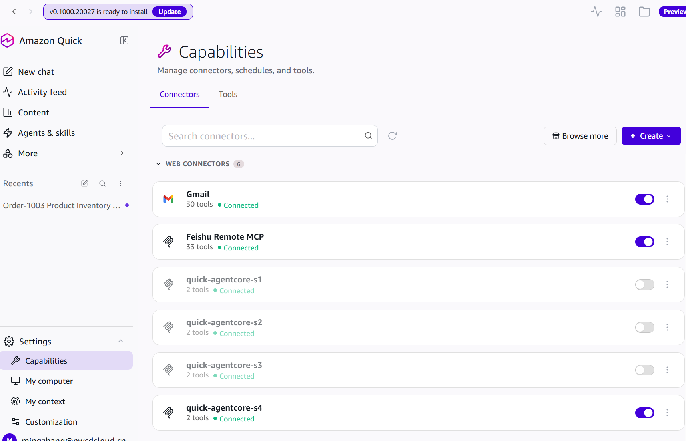

*图 74：启用场景四连接器，并暂时禁用其他场景连接器。*

输入以下请求，检查 Quick 是否先调用订单工具，再将订单需求传给库存工具。

> 查询订单 ORDER-1003 的商品需求并检查库存可用性。

下图展示了一次调用过程：Quick 获取订单需求后，继续调用场景四的库存工具，并汇总查询结果。

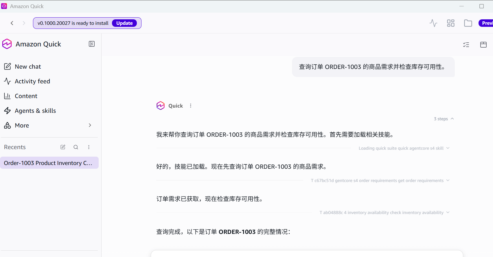

*图 75：通过场景四连接器查询订单 ORDER-1003 并检查库存。*

### 与其他认证鉴权方式的搭配

本场景的重点是在验证私有网络的连接，为简化演示采用了 Cognito 服务身份调用 Lambda工具，但是实际上也可以参考 场景二 或者 场景三，实现为其他认证鉴权方式。

## 清理资源

完成演示后，先在 Quick 中删除对应连接器，再删除场景根栈。对于场景四，该顺序可以避免连接器仍引用 VPC 连接而影响网络资源清理。

以下以场景一为例；删除其他场景时，替换 `STACK_NAME`。

```bash
STACK_NAME=quick-agentcore-s1
aws cloudformation delete-stack \
  --stack-name "$STACK_NAME" \
  --region "$AWS_REGION"
aws cloudformation wait stack-delete-complete \
  --stack-name "$STACK_NAME" \
  --region "$AWS_REGION"
```

删除根栈会递归清理其嵌套栈管理的 Gateway、target、API Gateway、IAM、Cognito 和网络资源，并移除场景二、三添加到业务函数 resource policy 的调用权限。

场景一至三引用的三只共享业务Lambda、外部Secrets Manager凭据、Entra应用、既有Quick SSO和artifact bucket不属于这些场景栈。Scenario4的两只专属VPC Lambda属于Scenario4栈并会随栈删除；手工创建的Quick Connector仍需单独处理。

若删除失败，先检查 CloudFormation stack events，再定位仍被引用的 Quick ENI、Resolver endpoint 或 VPC endpoint，按依赖关系和资源归属处理。

## 总结

本文通过相同的订单与库存工具，展示了四种企业应用接入方式：

- **场景一：服务身份访问。** 通过 Cognito client credentials flow 和最小权限 IAM 调用 Lambda 工具。
- **场景二：混合下游认证。** 为不同 Gateway target 分别配置 Basic 认证与 Entra ID 应用身份。
- **场景三：用户身份委托。** 通过 Entra ID OBO 传递用户身份，并分别校验 scope 和业务 app role。
- **场景四：Gateway私网调用。** Quick通过Gateway PrivateLink访问MCP，专属业务Lambda运行在VPC内；Cognito OAuth因其domain限制保持Public network。

这些能力可以按业务需求组合。无论选择哪个场景，都应分别设计 Quick 登录、Gateway 入站访问和下游业务访问三条信任边界，让工具调用与企业既有的身份、权限和网络策略保持一致。

完整部署参数与验证步骤见 [CloudFormation 部署说明](../cloudformation/README.md)，用户委托配置见 [Entra ID 配置指南](../gateway/Scenario3UserDelegation/ENTRA_SETUP.md)。
